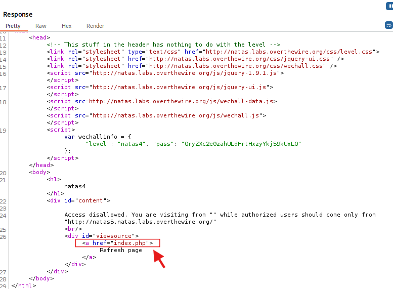

## Natas Labs

## Terminal
Step-1: First you can start the terminal you will see the starting stage of terminal then you need to go that terminal you can access that terminal by " sudo su "

Step-2: After that terninal can ask you the password

Step-3: Password : " kali "

Step-4: then you enter the password you will not able to see that password but it can automatically access

Step-5: It will navigate Home that means Root, it will shows " root@kali "

Step-6: It will shows in red color. It is the simple checking that  you are in root or not and below that root you will see " #  " in red color that means Finally you can start the Terminal

Step-7: Go to Downnloads . In Downloads Go to Burp suite . Then Run the Burp suite 

## Level-0
What you Need to do :
+ Username : natas0
+  Password : natas0
+ Domain : http://natas0.natas.labs.overthewire.org
## Explination
Step 1:  Go to Firefox Browser (Connection on Foxy proxy extension)

Step 2: Connect to natas0.natas.labs.overthewire.org

Step 3: Then login with username and password

Step 4: You will see the page like this

Step 5: You will need to find the password for level-1

Step 6: Set up the proxy on Burp suite in fire fox browser (Send), Then refresh the page

                     

Step 7: Go to Burp suite, then click on Proxy tab 

Step 8: In that proxy web you will intercept, Then  click on intercept

Step 9: In that intercept you will see the intercept on and intercept off, Then Click on the intercept on (Receive)

                     

Step 10:  In that Proxy tab then click on history(HTTP History). Then you will see the natas 0 http link. Then click on that link, Then you will see the request

                              

Step 11: Then right click on that request. you will see the option of export. Then click on send Repeater. 

Step 12: Then click on  Repeater. Whenever once a highlight after send repeater, which is placed in  menus bar

 Step 13: you will see request. Then click on send button. you will see the response.

Step 14: In that response you will see the password for level-1

 

## Level-1
+ Username : natas1
+  Password : 0nzCigAq7t2iALyvU9xcHlYN4MlkIwlq
+ Domain : http://natas1.natas.labs.overthewire.org

## Explination
Step 1:  Go to Firefox Browser (Connection on Foxy proxy extension)

Step 2: Connect to natas1.natas.labs.overthewire.org

Step 3: Then login with username and password

Step 4: You will see the page like this

Step 5: You will need to find the password for level-2

Step 6: Set up the proxy on Burp suite in fire fox browser (Send), Then refresh the page

             

Step 7: Go to Burp suite, then click on Proxy tab 

Step 8: In that proxy web you will intercept, Then  click on intercept

Step 9: In that intercept you will see the intercept on and intercept off, Then Click on the intercept on (Receive)

                   

Step 10:  In that Proxy tab then click on history(HTTP History). Then you will see the natas1 http link. Then click on that link, Then you will see the request

                         

Step 11: Then right click on that request. you will see the option of export. Then click on send Repeater. 

Step 12: Then click on  Repeater. Whenever once a highlight after send repeater, which is placed in  menus bar

 Step 13: you will see request. Then click on send button. you will see the response.

Step 14: In that response you will see the password for level-2

 

## Level-2
+ Username : natas2
+  Password : TguMNxKo1DSa1tujBLuZJnDUlCcUAPlI
+ Domain : http://natas2.natas.labs.overthewire.org

## Explination
Step 1:  Go to Firefox Browser (Connection on Foxy proxy extension)

Step 2: Connect to natas1.natas.labs.overthewire.org

Step 3: Then login with username and password

Step 4: You will see the page like this

Step 5: You will need to find the password for level-3

Step 6: Set up the proxy on Burp suite in fire fox browser (Send), Then refresh the page

                  

Step 7: Go to Burp suite, then click on Proxy tab 

Step 8: In that proxy web you will intercept, Then  click on intercept

Step 9: In that intercept you will see the intercept on and intercept off, Then Click on the intercept on (Receive)                 

Step 10:  In that Proxy tab then click on history(HTTP History). Then you will see the natas2 http link. Then click on that link, Then you will see the request

Step 11: Then right click on that request. you will see the option of export. Then click on send Repeater. 

Step 12: Then click on  Repeater. Whenever once a highlight after send repeater, which is placed in  menus bar

 Step 13: you will see request. Then click on send button. you will see the response.

Step 14: In that response you will see the file.

 

Step 15: Then foward the link or Disable the Burpsuite, Then Go to firefox browser, Then enter the leve2 link along with file 

Step 16: Then click on that users.txt, Then you will see the password for level-3

## Level-3
+ Username : natas3
+  Password : 3gqisGdR0pjm6tpkDKdIWO2hSvchLeYH
+ Domain : http://natas3.natas.labs.overthewire.org

## Explination

Step 1:  Go to Firefox Browser (Connection on Foxy proxy extension)

Step 2: Connect to natas1.natas.labs.overthewire.org

Step 3: Then login with username and password

Step 4: You will see the page like this

Step 5: You will need to find the password for level-4

Step 6: Set up the proxy on Burp suite in fire fox browser (Send), Then refresh the page

                  

Step 7: Go to Burp suite, then click on Proxy tab 

Step 8: In that proxy web you will intercept, Then  click on intercept

Step 9: In that intercept you will see the intercept on and intercept off, Then Click on the intercept on (Receive)                 

Step 10:  In that Proxy tab then click on history(HTTP History). Then you will see the natas2 http link. Then click on that link, Then you will see the request

Step 11: Then right click on that request. you will see the option of export. Then click on send Repeater. 

Step 12: Then click on  Repeater. Whenever once a highlight after send repeater, which is placed in  menus bar

 Step 13: you will see request. Then click on send button. you will see the response.

Step 14: In that response there is   no password.

 

Step 15: Then foward the link or Disable the Burpsuite, Then Go to firefox browser, Then enter the leve2 link along with robots.txt 

Step 16: Then enter the leve2 link along with/s3cr3t/ 

Step 17: Then click on that users.txt, Then you will see the password for level-3

## Level-4
+ Username : natas4
+  Password : QryZXc2e0zahULdHrtHxzyYkj59kUxLQ
+ Domain : http://natas4.natas.labs.overthewire.org

## Explination
Step 1:  Go to Firefox Browser (Connection on Foxy proxy extension)

Step 2: Connect to natas1.natas.labs.overthewire.org

Step 3: Then login with username and password

Step 4: You will see the page like this

Step 5: You will need to find the password for level-5

Step 6: Set up the proxy on Burp suite in fire fox browser (Send), Then refresh the page

                  

Step 7: Go to Burp suite, then click on Proxy tab 

Step 8: In that proxy web you will intercept, Then  click on intercept

Step 9: In that intercept you will see the intercept on and intercept off, Then Click on the intercept on (Receive)                 

Step 10:  In that Proxy tab then click on history(HTTP History). Then you will see the natas2 http link. Then click on that link, Then you will see the request

Step 11: Then right click on that request. you will see the option of export. Then click on send Repeater. 

Step 12: Then click on  Repeater. Whenever once a highlight after send repeater, which is placed in  menus bar

 Step 13: you will see request. Then click on send button. you will see the response.

Step 14: In that response there is   no password.

 

Step 15: Go to firefox browser, Then enter the leve2 link along with robots.txt 

Step 16: Then enter the leve2 link along with/s3cr3t/ 

Step 17: Then click on that users.txt, Then you will see the password for level-3

 

