# BANDIT LABS
## Terminal
1.First you can start the terminal you will see the starting stage of terminal the you need to go that terminal you can access that terminal by " sudo su " 
   
2.After that terninal can ask you the password 
   
3. Password : " kali "
   
4. then you enter the password you will not able to see that password but it can automatically access
   
5. It will navigate Home that means Root, it will shows " root@kali " 
   
6. It will shows in red color. It is the simple checking that  you are in root or not and below that root you will see " #  " in red color that means Finally you can start the Terminal
## Level 0
What you Need to do :
+ Username : bandit0   
+  Password : bandit0                        
+ Domain : ssh bandit0@bandit.labs.overthewire.org -p 2220   
+ Port Num : 2220
### Commands
+ ls = list files  
+ cat = read file
### Explination 
Step 1: Connect to the server as bandit0.

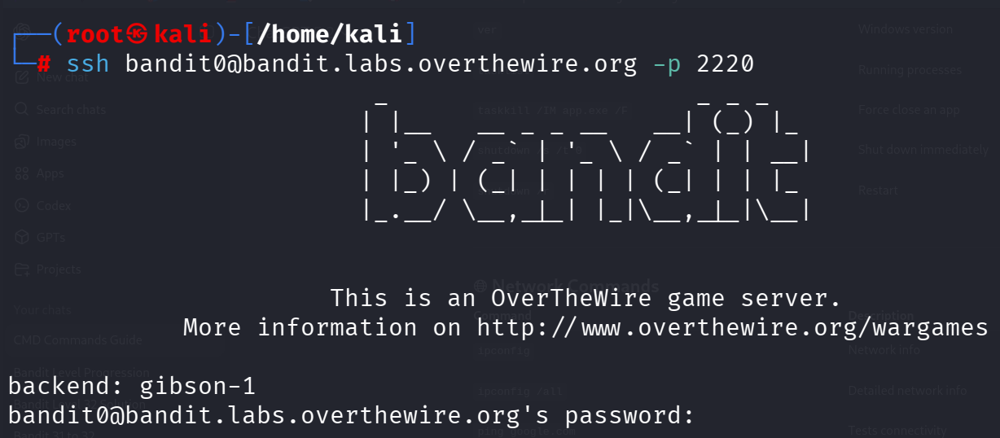

Step 2: Use ls command to get a list of files and directories in the current directory.

Step 3: Use cat command to read the contents of a file.

Step 4: Get the password for Level 1.

Step 5: Log out of bandit0. That means use exit command to log out.

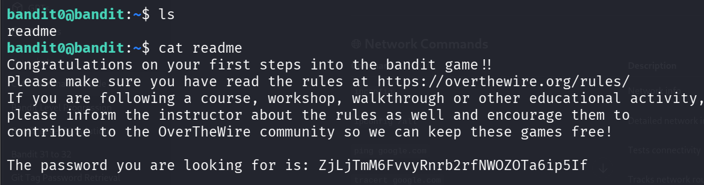

##  Level 1
+ Username : bandit1   
+  Password :  ZjLjTmM6FvvyRnrb2rfNWOZOTa6ip5If                  
+ Domain : ssh bandit1@bandit.labs.overthewire.org -p 2220   
+ Port Num : 2220
### Commands
+ ls = list files  
+ cat = read file
### Explination
Step 1: Connect to the server as bandit1.

Step 2: Use ls command to get a list of files and directories in the current directory.

Step 3: Use cat command to read the contents of a file.But shows  -  means stdin.

Step 4: Use cat command to read the contents of a file.

Step 5: Get the password for Level 1.

!

##  Level 2
+ Username : bandit2   
+ Password :   263JGJPfgU6LtdEvgfWU1XP5yac29mFx                    
+ Domain :   ssh bandit2@bandit.labs.overthewire.org -p 2220 
+ Port Num : 2220
### commands 
-  ls = list files
 - ls  -i = list files with inode numbers.
 - find = Find the files and directories Based on    Name, size, Modification time
### Explination
Step 1: Connect to the server as bandit2.

Step 2: Use ls command to get a list of files and directories in the current directory.

Step-3: Use ls -b  command for list files with escaped special characters.

Step-4: Use ls -i  command for list files with inode numbers.

Step_5: Use find command to find a file with a specific inode number.

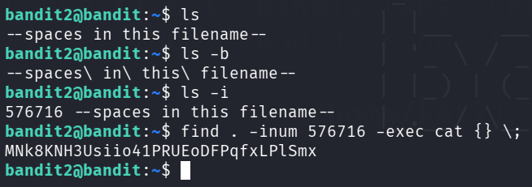

## Level-3
+ Username : bandit3   
+  Password :     MNk8KNH3Usiio41PRUEoDFPqfxLPlSmx            
+ Domain :   ssh bandit3@bandit.labs.overthewire.org -p 2220
+ Port Num : 2220
### Commands
- ls = list files
- cd = change directory 
- ls -a = list all files, including hidden ones.
 - find = Find the files and directories Based on    Name, size, Modification time
### Explination
Step 1: Connect to the server as bandit3.

Step 2: Use ls command to get a list of files and directories in the current directory.

Step 3: It shows inhere Directory.Then use cd command to move into the inhere directory.

Step 4: Use ls -a command to list all files, including hidden ones. It shows Hiding from you.

Step 5: Use find command to find a file with a specific type.  Then you will get the password.

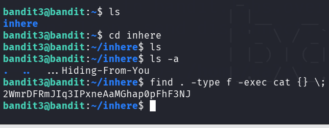

## Level-4
+ Username : bandit4   
+  Password :  2WmrDFRmJIq3IPxneAaMGhap0pFhF3NJ                      
+ Domain :   ssh bandit4@bandit.labs.overthewire.org -p 2220 
+ Port Num : 2220
### Commands
- ls = list files  
- cd = change directory
- file = file type
-  cat = read file
### Explination
Step 1: Connect to the server as bandit4.

Step 2: Use ls command to get a list of files and directories in the current directory.

Step 3: It shows inhere Directory.Then use cd command to move into the inhere directory.

Step 4: Use ls command . Then you will get the lot of files.

Step-5: Use file ./* to get the type of each file. Where yu will get ASCII code.

Step-6: Use cat command to read the contents of a file.

!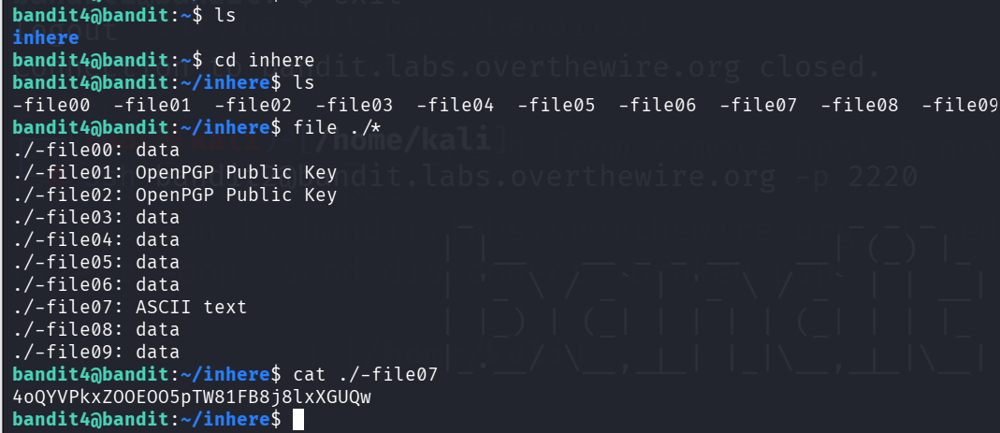

 Optional - so It shows diamond symboles along with charecteres in a password

    cat ./-file02 | od -An -tx1

## Level-5
+ Username : bandit5   
+  Password :   4oQYVPkxZOOEOO5pTW81FB8j8lxXGUQw                      
+ Domain :  ssh bandit5@bandit.labs.overthewire.org -p 2220  
+ Port Num : 2220
### Commands
- ls = list files  
- cd = change directory
 - find = Find the files and directories Based on    Name, size, Modification time
 - cat = read file
### Explination
Step 1: Connect to the server as bandit5.

Step 2: Use ls command to get a list of files and directories in the current directory.

Step 3: It shows inhere Directory.Then use cd command to move into the inhere directory.

Step 4: Use ls command . Then you will get the lot of Directories.

Step-5: Use find command to find a file with a specific size.Ten you will get exact file.

Step-6: Use cat command to read the contents of a file.

## Level-6
+ Username : bandit6   
+  Password : HWasnPhtq9AVKe0dmk45nxy20cvUa6EG                    
+ Domain :  ssh bandit6@bandit.labs.overthewire.org -p 2220 
+ Port Num : 2220
### Commands
- find = Find the files and directories Based on    Name, size, Modification time
 - cat = Display the file contents on terminal
### Explination
Step 1: Connect to the server as bandit6.

Step 2: Use ls command to get a list of files and directories in the current directory.But you will not get the files or directories.

Step 3: Use find command to find a file with a specific user, group and size.

step-4: It will shows the certain path to the file.

step-5: Use cat command to read the contents of a file.

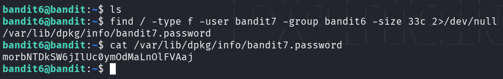

## Level-7
+ Username : bandit7   
+  Password :   morbNTDkSW6jIlUc0ymOdMaLnOlFVAaj                  
+ Domain : ssh bandit7@bandit.labs.overthewire.org -p 2220  
+ Port Num : 2220
### Commands
- ls = list files
- grep = Search for lines that match a pattern for a file.
### Explination
Step 1: Connect to the server as bandit7.

Step 2: Use ls command to get a list of files and directories in the current directory.Then you will get data.txt

Step-3: Use grep command to search for lines that match a pattern for a file.

step-4: Finally you will get the password.

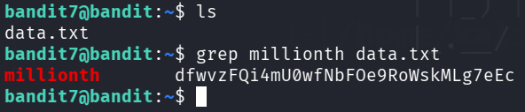

## Level-8
+ Username : bandit8   
+  Password :  dfwvzFQi4mU0wfNbFOe9RoWskMLg7eEc                   
+ Domain : ssh bandit8@bandit.labs.overthewire.org -p 2220  
+ Port Num : 2220
### Commands
- ls = list files 
- sort = sort data
- uniq = print unique lines
### Explination
step 1: Connect to the server as bandit8.

step 2: Use ls command to get a list of files and directories in the current directory.Then you will get data.txt

step-3: Use sort command to sort data.Along with uniq command you will get the password.

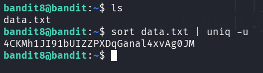

## Level-9
+ Username : bandit9   
+  Password : 4CKMh1JI91bUIZZPXDqGanal4xvAg0JM                    
+ Domain : ssh bandit9@bandit.labs.overthewire.org -p 2220  
+ Port Num : 2220
### Commands
- ls = list files 
- strings = extract human-readable text
- grep = search for lines that match a pattern for a file
### Explination
Step 1: Connect to the server as bandit9.

Step 2: Use ls command to get a list of files and directories in the current directory.Then you will get data.txt

Step-3: Use strings command to extract human-readable text.

step-4: Use grep command to search for lines that match a pattern for a file.

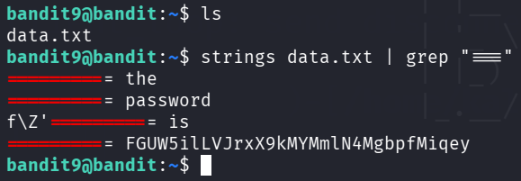
## Level-10
+ Username : bandit10   
+  Password :  FGUW5ilLVJrxX9kMYMmlN4MgbpfMiqey                   
+ Domain :  ssh bandit10@bandit.labs.overthewire.org -p 2220 
+ Port Num : 2220
### Commands
- ls = list files 
- cat = Display the file contents on terminal
- base64 = encode a file
- -d = decode
### Explination

Step-1: Connect to the server as bandit10.

Step-2: Use ls command to get a list of files and directories in the current 
directory. Then you will get data.txt.

Step-3: Use base64 command to encode a file. Then you will decode the Base64 data.

step-4: Finally you will get the password.

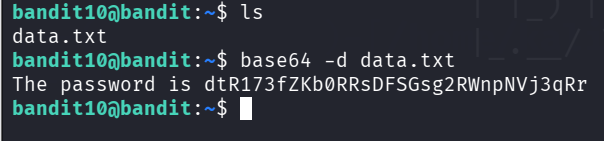

## Level-11
+ Username : bandit11   
+  Password :   dtR173fZKb0RRsDFSGsg2RWnpNVj3qRr                  
+ Domain :  ssh bandit11@bandit.labs.overthewire.org -p 2220 
+ Port Num : 2220
### Commands
- cat = Display the file contents on terminal
- tr = translate characters in a file
### Explination

Step 1: Connect to the server as bandit11.

Step 2: Use ls command to get a list of files and directories in the current directory. Then you will get data.txt

Step-3: Use tr command and along with cat command to translate characters in a file.All letters (a–z, A–Z) are rotated by 13 positions (ROT13). Numbers and symbols are unchanged. ROT13 is symmetric: applying it once decodes the text.

Step-4: Finally you will get the password.

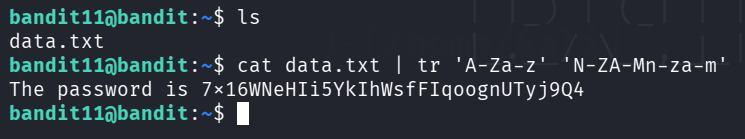

## Level-12
+ Username : bandit12
+  Password :  7x16WNeHIi5YkIhWsfFIqoognUTyj9Q4
+ Domain :  ssh bandit12@bandit.labs.overthewire.org -p 2220 
+ Port Num : 2220
### Commands
- ls = list files
- mkdir = make directory
- cd = change directory
- cp = copy a file
- mv = move a file
- xxd = move hexa decimal to binary
- -r = recursive
- file = file type
- gzip = compress to decompress
- bunzip2 = decompress
- tar = extract
- file * = inspects a file’s contents,
- cat =  read the contents of a file
### Explination
Step 1: Connect to the server as bandit12.

Step 2: Use ls command to get a list of files and directories in the current 
directory. Then you will get data.txt

Step-3: Create a temporary directory and change to it.

Step-4: Copy the data.txt file into temp directory.Then Rename it as data.hex. Convert the hex dump back into a binary file.  

Step-5: Then check what kind of file it is. It will shows compressed file name gizpp compressed data.

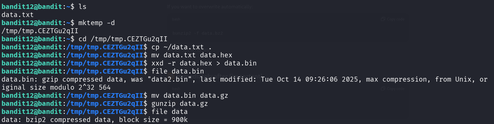

Step-6: Move the file to data.gz. Then decompress it.Check what kind of file it is.

Step-7: Then you will get another compressed file name bzip2 compressed data.

Step-8: Move the newly existing file to data.bz2. Then decompress it. check what 
kind of file it is.

Step-9: Then you will get another compressed file name POSIX tar archive.

Step-10: Extract the newly existing file to a tar file. Then immediately check 
list  of files.and check what kind of file it is.

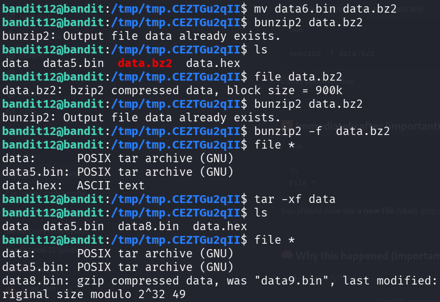

Step-11: Just keep looping until file says something like: ASCII text. Finally you will get the password.

## Level-13
+ Username : bandit13   
+ Password : FO5dwFsc0cbaIiH0h8J2eUks2vdTDwAn 
+ Domain : ssh bandit13@bandit.labs.overthewire.org -p 2220     [or]
+ Domain 1: scp -P 2220 bandit13@bandit.labs.overthewire.org:/home/bandit13/sshkey.private .
below is the image of level-13

### Commands
- ls = list files
- cat = Display the file contents on terminal
- nano = edit a file
- chmod = change file permissions
- scp = downnload the private key
### Explination

Step-1: You do not get a password for bandit14.
Instead, you are given a private SSH key.
You must use that key to log in as bandit14.

Step-2: Connect to the server as bandit13.

Step-3: Use ls command to get a list of files and directories in the current directory. Then you will get sshkey.private

Step-4: Use cat command to read the contents of a file. Copy the entire key and Paste the key into a text editor means nano tool.Reanme it to key and save it.This process on another terminal.

Step-5: Change the permissions of the key file.

Step-6: Use the private key to log in as bandit14.

#### 2nd Method
Step-1: Download the sshkey.private key.

Step-2:  Use the private key to log in as bandit14.

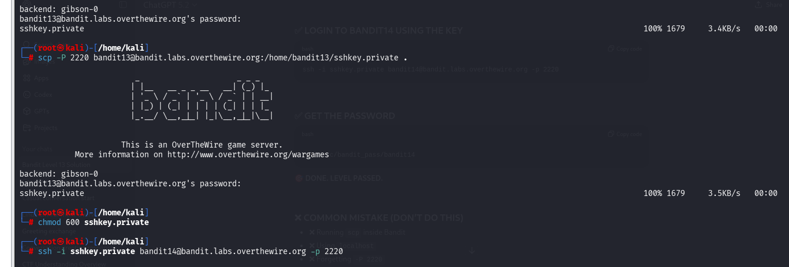

 ## Level-14
+ Username : bandit14
+  Password : MU4VWeTyJk8ROof1qqmcBPaLh7lDCPvS
+ Domain : ssh -i sshkey.private bandit14@bandit.labs.overthewire.org -p 2220
+ Port Num : 2220
### Commands
- cat = Display the file contents on terminal
- nc =
### Explination

Step 1: Connect to the server as bandit14.

Step 2: Use cat command to get current password.

Step-3: Use nc command to send the current password to port 30000.

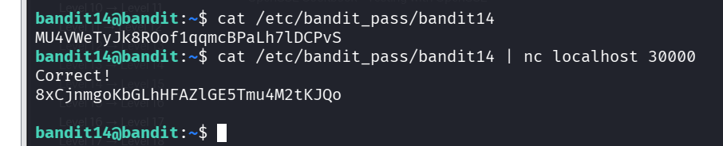

## Level-15
+ Username : bandit15
+  Password :  8xCjnmgoKbGLhHFAZlGE5Tmu4M2tKJQo
+ Domain : ssh bandit15@bandit.labs.overthewire.org -p 2220
+ Port Num : 2220
### Commands
- openssl = encrypt and decrypt
### Explination
Step 1: Connect to the server as bandit15.

Step 2: Conect securly to port 30001.

    openssl s_client -connect localhost:30001

Step-3: You should see a lot of SSL-related output — this is normal.

Step 4: Send the password to port 30001. That means Paste the Bandit 15 password.

Step 5: You will get the Password for bandit16.

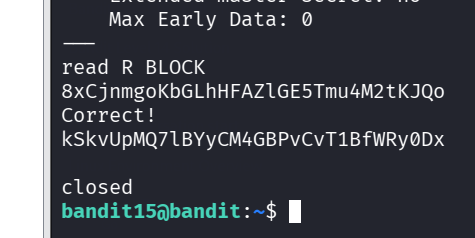

## Level-16
+ Username : bandit16
+  Password : kSkvUpMQ7lBYyCM4GBPvCvT1BfWRy0Dx
+ Domain : ssh bandit16@bandit.labs.overthewire.org -p 2220
+ Port Num : 2220
### Commands
- nmap = scan for open ports
- openssl = encrypt and decrypt
- echo = Display a string
- cat = Display the file contents on terminal
- -quit = quit
- nano = edit a file
- chmod = change permissions of a file
### Explination

Step 1: Connect to the server as bandit16.

Step 2: Scan for open ports (31000–32000).Use nmap to find listening services.

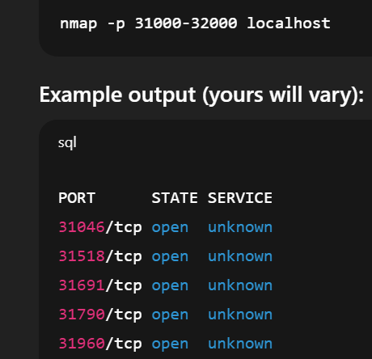

 Step 3: Identify which port uses SSL/TLS Use this below command. You will see certificate details, and Connection completes successfully
 
    openssl s_client -connect localhost:31046 

Step 4: Repeat this for each open port until one clearly supports SSL.You wiil see the Difference between them.

Step 5: But i found two ports are same How can i find that Correct one.

Step 6: If you find this one Protocol  : TLSv1.3

Step 7: At the TLSv1.3 protocol, is also same in two ports. How can i find that Correct one

Step 8: Run echo command to get the password of bandit16.  Then you will send along with bandit16 password to ports.Then you will get the sshkey.private.
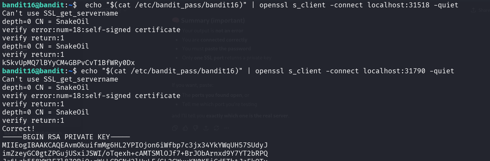

Step-9: Use cat command to read the contents of a file. Copy the entire key and Paste the key into a text editor means nano tool.Reanme it to key and save it.This process on another terminal.

Step-10: Change the permissions of the bandit16.sshkey file.

Step-11: Use the private key to log in as bandit17.

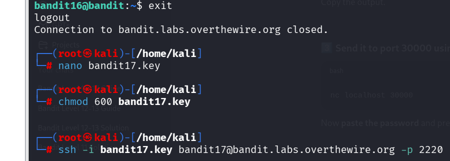

Step-12: Use cat command to get the password of bandit17.

## Level-17
+ Username : bandit17
+  Password :  EReVavePLFHtFlFsjn3hyzMlvSuSAcRD
+ Domain : ssh bandit17@bandit.labs.overthewire.org -p 2220
+ Port Num : 2220
### Commands
- ls = list files
- diff = compare files
- grep = search for lines that match a pattern
### Explination

Step 1: Connect to the server as bandit17.

Step 2: Use ls command to get a list of files and directories in the current directory.

Step-3: It will shows passwords.old and passwords.new.

Step-4: Use diff command to compare files.Then you will get the use grep command to 
search for lines that match a pattern.

Step-5: Finally you will get the password.

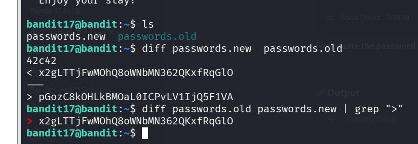

## Level-18
+ Username : bandit18
+  Password :  x2gLTTjFwMOhQ8oWNbMN362QKxfRqGlO
+ Domain : ssh bandit18@bandit.labs.overthewire.org -p 2220 cat readme
+ Port Num : 2220
### Commands
- cat = Display the file contents on terminal
- readme = Display the file contents on terminal
### Explination

Step 1: Connect to the server as bandit18.

Step-2: But it immediately exits (“Byebye!”).In Bandit18, your .bashrc is modified so 
that as soon as you log in.

Step-3: Your password is correct and You are now officially on Bandit18 .This behavior belongs to Level 18 → 19. How to actually stay in Bandit18. You must bypass .bashrc.What you’re seeing now is normal SSH behavior, not a crash.
This is intentional for security.

Step-4: SSH logs in and prompts for a password. Enter Password: Does NOT start an interactive shell. Runs cat readme

Step-5: It Prints the password for bandit19. Then Immediately exits.

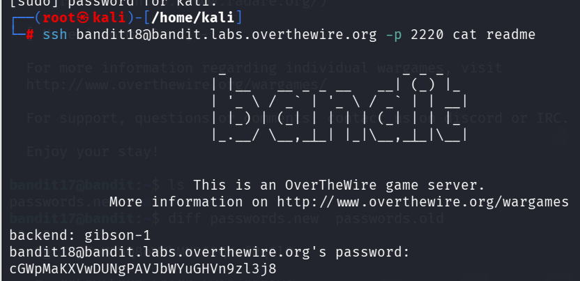

## Level-19
+ Username : bandit19
+  Password : cGWpMaKXVwDUNgPAVJbWYuGHVn9zl3j8
+ Domain : ssh bandit19@bandit.labs.overthewire.org -p 2220
+ Port Num : 2220
### Commands
- ls -1 = list files
- cat = Display the file contents on terminal
### Explination
Step 1: Connect to the server as bandit19.

Step 2: Use ls -l command to get a list of files and directories in the current directory.

3. Run the binary without arguments.Run a command as another user.

Step-4: Usage: ./bandit20-do <command>.Use the binary to read the password.Tell it to run cat as bandit20:

Step-5: Finally you will get the password for bandit20

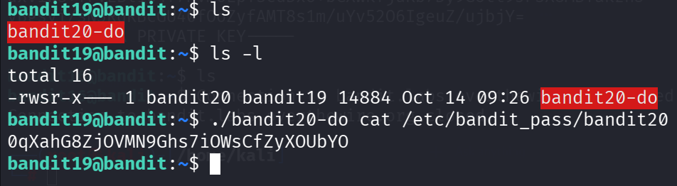

## Level-20
+ Username : bandit20
+  Password :  0qXahG8ZjOVMN9Ghs7iOWsCfZyXOUbYO
+ Domain : ssh bandit20@bandit.labs.overthewire.org -p 2220
+ Port Num : 2220
### Commands
- nc = netcat
- suconnect = send the password
### Explination
Step 1: Connect to the server as bandit20.

Step-2: In the first terminal, run nc -l -p 4444.

Step-3: In the second terminal, Also connect to the server as bandit20.

Step-4: Run ./suconnect 4444.

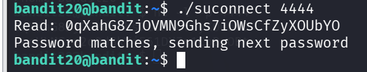

Step-5: Then you will return back to the first terminal.

Step-6: Now paste bandit20 password in the first terminal.

Step-7: You will get the password for bandit21.

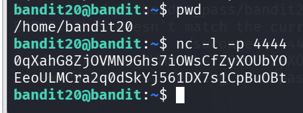

## Level-21
+ Username : bandit21
+  Password :  EeoULMCra2q0dSkYj561DX7s1CpBuOBt
+ Domain : ssh bandit21@bandit.labs.overthewire.org -p 2220
+ Port Num : 2220
### Commands
- ls = list files
- cat = Display the file contents on terminal
- echo = Display a string
- MD5 =  MD5 hash
### Explination
Step-1: Connect to the server as bandit21.

Step-2: Use ls command to get a list of files in /etc/cron.d/ . Then you will see files along with cronjob_bandit22

Step-3: Use cat command to read cronjob_bandit22

Step-4: It wil show the path of the script /usr/bin/cronjob_bandit22.sh

Step-5: Use cat command to read cronjob_bandit22.sh

Step-6: It will show the some information.

Step-7: Use echo command to tell that iam user bandit22 along with md5sum

Step-8: Uses the MD5 hash as a filename in /tmp/

Step-9:Writes the bandit22 password into that file. Makes it readable

Step 10: It will show the some information. Then Using cat command along with that information with the temporary file.

Step-11: It will show the password for bandit22

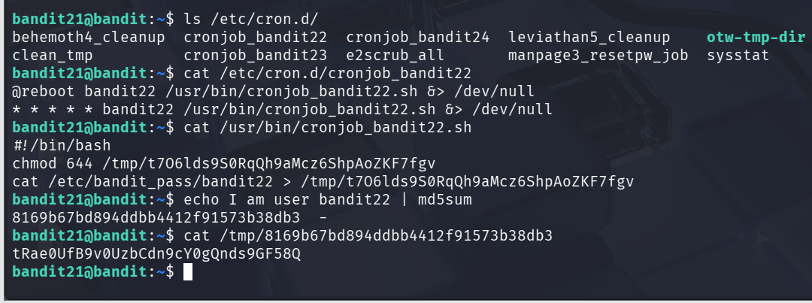

## Level-22
+ Username : bandit22
+  Password :  tRae0UfB9v0UzbCdn9cY0gQnds9GF58Q
+ Domain : ssh bandit22@bandit.labs.overthewire.org -p 2220
+ Port Num : 2220
### Commands
- ls = list files
- cat = Display the file contents on terminal
- echo = Display a string
- MD5 =  MD5 hash
### Explination
Step-1: Connect to the server as bandit22.

Step-2: Use ls command to get a list of files in /etc/cron.d/ . Then you will see files along with cronjob_bandit23

Step-3: Use cat command to read cronjob_bandit23

Step-4: It wil show the path of the script /usr/bin/cronjob_bandit23.sh

Step-5: Use cat command to read cronjob_bandit23.sh

Step-6: It will show the some information.

Step-7: Use echo command to tell that iam user bandit23 along with md5sum

Step-8: Uses the MD5 hash as a filename in /tmp/

Step-9:Writes the bandit23 password into that file. Makes it readable

Step 10: It will show the some information. Then Using cat command along with that information with the temporary file.

Step-11: It will show the password for bandit23

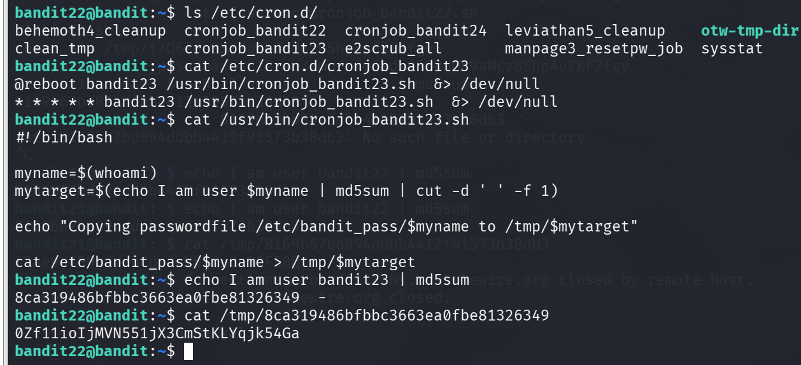

## Level-23
+ Username : bandit23
+  Password :  0Zf11ioIjMVN551jX3CmStKLYqjk54Ga
+ Domain : ssh bandit23@bandit.labs.overthewire.org -p 2220
+ Port Num : 2220
### Commands
- ls = list files
- cat = Display the file contents on terminal
- nano = Edit a file
- chmod = Change file permissions
### Explination
Step-1: Connect to the server as bandit22.

Step-2: Use ls command to get a list of files in /etc/cron.d/ . Then you will see files along with cronjob_bandit24

Step-3: Use cat command to read cronjob_bandit24

Step-4: It wil show the path of the script /usr/bin/cronjob_bandit24.sh

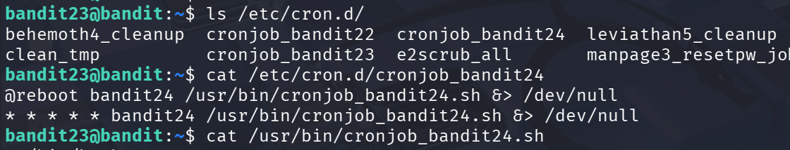

Step-5: Use cat command to read cronjob_bandit24.sh

Step-6: It will show the some script information.

Step-7: Use  export NANO_DISABLE_HISTORY=1 . Quick check that your script is fine. After saving, verify it. Using cat command.

Step-8: Change the permissions Using chmod command.

Step-9: Using cat command to get the password for bandit24.

Step-10: It will show the password for bandit24

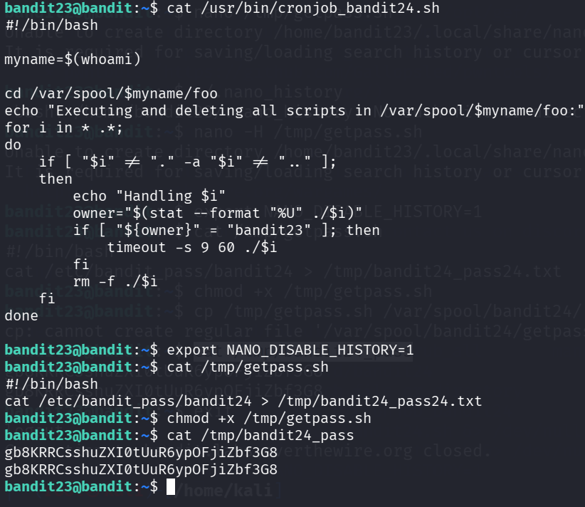

## Level-24
+ Username : bandit24
+  Password :  gb8KRRCsshuZXI0tUuR6ypOFjiZbf3G8
+ Domain : ssh bandit24@bandit.labs.overthewire.org -p 2220
+ Port Num : 2220
### Commands
- echo = Display a string
- nc = netcat
### Explination
 Strategy:

    Generate all PINs from 0000 → 9999    
    Prefix each with the bandit24 password
    Pipe everything into one nc (netcat) connection
    Watch for the line that contains the bandit25 password
    seq -w keeps the PINs 4 digits (0001 instead of 1)
    The loop sends all attempts at once
    nc keeps one open TCP connection, which is exactly what the daemon wants

Step-1: Connect to the server as bandit24.

Step 2 : Run the script. Before running the script do one thing firstly, replace the BANDIT24_PASSWORD with the actual password for bandit24 in the script.    

Step 3: It will show the password for bandit25

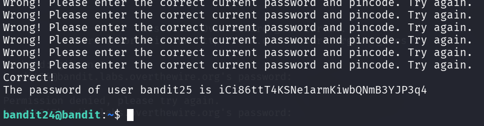

## Level-25
+ Username : bandit25
+ Password :  iCi86ttT4KSNe1armKiwbQNmB3YJP3q4
+ Domain : ssh bandit25@bandit.labs.overthewire.org -p 2220
+ Port Num : 2220
### Commands
ls = list files
file = check file type
cat = Display the file contents on terminal
nano = Edit a file
chmod = Change file permissions
grep = Search for a pattern
vim = Edit a file
shell = Open a shell
set shell = Change the shell
### Explination
Step-1: Login to bandit25

Step-2: Run the Ls commad to get the files, after file type checking it shows private key,then run the cat command this display  private key content

 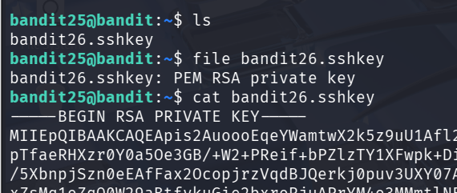

Step-3: (Opening in nano to edit, Rename it and save it (sshkey)). Then Set correct permissions on the key

       chmod 600 sshkey
Step-4: Login to bandit26 using the key.

        ssh -i bandit26.sshkey bandit26@bandit.labs.overthewire.org -p 2220
Step-5: bandit26 does NOT allow password login with the ssh key. bandit26 does not give a normal shell.
Step-6: Check: cat /etc/passwd  it shows lot of files. Then use grep command to find bandit26

Step-7: use cat command to check the shell of bandit26

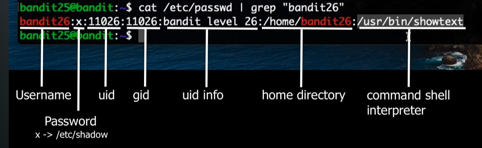

Step-8 : Login to bandit26 using the key

     ssh -i bandit26.sshkey bandit26@bandit.labs.overthewire.org -p 2220  
Step-9 : After login attemt of bandit26 it will show like bandit26 image. Then
 Resize (compress) the terminal,Make the terminal window small in height of image.This forces more to pause and show.

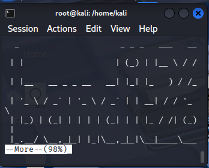

 Step-10 : Then try to login again to bandit26.
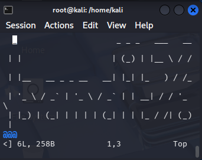

Step-10 : Open vi from more, While --More-- is visible, press: v

Step-11 : Run :shell it will shows bandit26 two images whenever scroll page up you will see the same image. Then Run:
 
    :set shell?
Step-12 : it will show shell location /bin/bash Then Run:

     :set shell=/bin/bash 
 Step-13 :  :shell  press ENTER

Step-14 : You now have a real bash shell as bandit26.

Step-15 : use ls command to check the files . Then see the files and run the cat command to check the content of the files

Step-16 : Run the cat command to getting the password  bandit26 password  But that password is not useful for bandit26 login Be only open in vi editor because of --more-- 

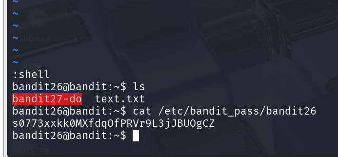

## Level-26
+ Username : bandit26
+  Password :  s0773xxkk0MXfdqOfPRVr9L3jJBUOgCZ
+ Domain : ssh -i bandit26.sshkey bandit26@bandit.labs.overthewire.org -p 2220
+ Port Num : 2220
### Commands
vim = Edit a file
shell = Open a shell
set shell = Change the shell
ls = list files
cat = Display the file contents on terminal
### Explination
Step-1 : Login to bandit26 using the key . But that password is not useful for bandit26 login Be only open in vi editor because of --more--

     ssh -i bandit26.sshkey bandit26@bandit.labs.overthewire.org -p 2220

Step-2 : Resize (compress) the terminal,Make the terminal window small in height.This forces more to pause and show:

Step-3 : Open vi from more, While --More-- is visible, press: v

Step-4 : Run :shell it will shows bandit26 two images whenever scroll page up you will see the same image. Then Run:
 
    :set shell?
Step-5 : it will show shell location /bin/bash Then Run:

     :set shell=/bin/bash 
 Step-6 :  :shell  press ENTER

Step-7 : You now have a real bash shell as bandit26.

Step-8 : use ls command to check the files . Then see the files and run the cat command to check the content of the files

Step-9 : Finally you will get the password.getting the password  bandit26 password

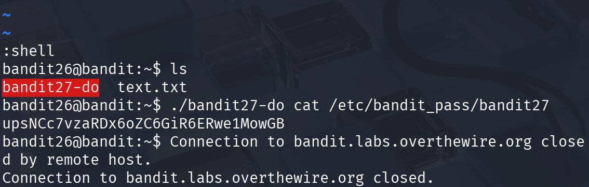

## Level-27
+ Username : bandit27
+  Password : upsNCc7vzaRDx6oZC6GiR6ERwe1MowGB
+ Domain : git clone ssh://bandit27-git@bandit.labs.overthewire.org:2220/home/bandit27-git/repo
+ Port Num : 2220
### Commands
 git = Git version control system
 git clone = Clone a repository into a new directory
 cd = Change directory
 git ls-files = List files
 type = Display the type of a file
### Explination
Step-1: Open a terminal on your local machine (Command prompt),Make sure git is installed: git --version, If not, install Git using your OS package manager.

Step-2: Run git command for checking installation or not

Step-3:Clone the repository to use the git clone command.

Step-4: After that it asks for password,  Instead of copy and paste Enter the password Manually.Because it not accepted copy and paste.

Step-5: Then observe path is correct format ok otherwise change it your System path.

Step-7: Then change the path into repo.View list of files in the repo. 

Step-8: Read the README file to get the password.

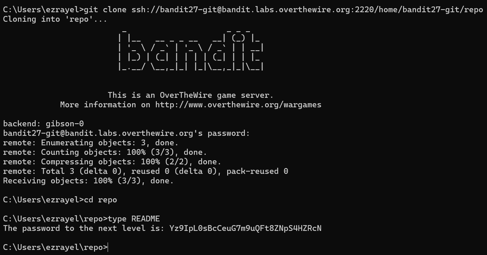

## Level-28
+ Username : bandit28
+  Password :  Yz9IpL0sBcCeuG7m9uQFt8ZNpS4HZRcN
+ Domain : git clone ssh://bandit28-git@bandit.labs.overthewire.org:2220/home/bandit28-git/repo
+ Port Num : 2220
### Commands
git = Git version control system
 git clone = Clone a repository into a new directory
 cd = Change directory
 git ls-files = List files
 type = Display the type of a file
 git log = Show commit logs
 git log -p = Show commit logs with patch
### Explination
Step-1: Open a terminal on your local machine (Command prompt),Make sure git is installed: git --version, If not, install Git using your OS package manager.

Step-2: Run git command for checking installation or not

Step-3:Clone the repository to use the git clone command.

Step-4: After that it asks for password,  Instead of copy and paste Enter the password Manually.Because it not accepted copy and paste.

Step-5: Then observe path is correct format ok otherwise change it your System path.

Step-7: Then change the path into repo.Already have repo delete that.View list of files in the repo.

Step-8: Read the README file to get the password.But in xxxx format.

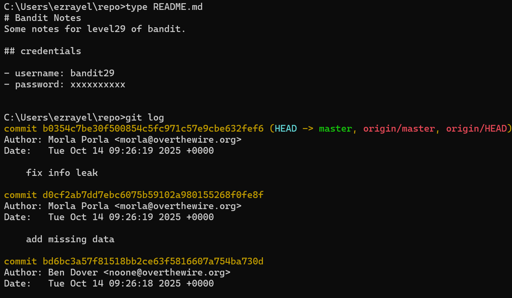

Step-9:View commit history using git log, You should see more than one commit.Then View 
changes between commits by using git log -p.Then you will see the password

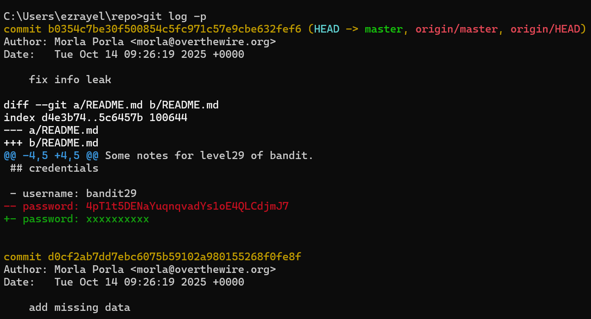

## Level-29
+ Username : bandit29
+  Password :  4pT1t5DENaYuqnqvadYs1oE4QLCdjmJ7
+ Domain : git clone ssh://bandit29-git@bandit.labs.overthewire.org:2220/home/bandit29-git/repo
+ Port Num : 2220
### Commands
git = Git version control system
 git clone = Clone a repository into a new directory
 cd = Change directory
 git ls-files = List files
 type = Display the type of a file
 git branch = List branches
 git checkout = Switch branches
### Explination
Step-1: Open a terminal on your local machine (Command prompt),Make sure git is installed: git --version, If not, install Git using your OS package manager.

Step-2: Run git command for checking installation or not

Step-3:Clone the repository to use the git clone command.

Step-4: After that it asks for password,  Instead of copy and paste Enter the password Manually.Because it not accepted copy and paste.

Step-5: Then observe path is correct format ok otherwise change it your System path.

Step-7: Then change the path into repo.Already have repo delete that.View list of files in the repo.

Step-8: Read the README file .But it has no password.

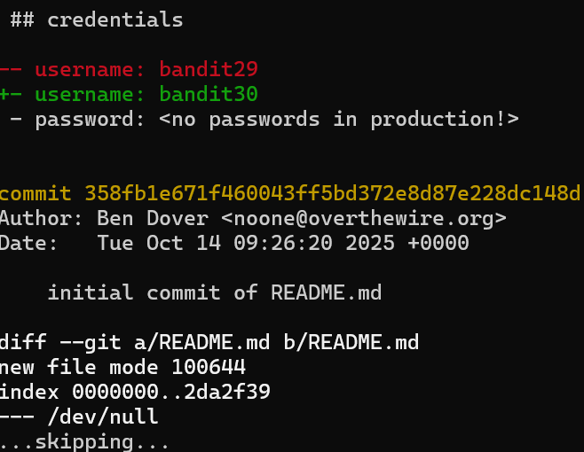

Step-9: Check git Branch .Then switch the dev branch.View list of files .

step-10: Read the README file .it will show the password.

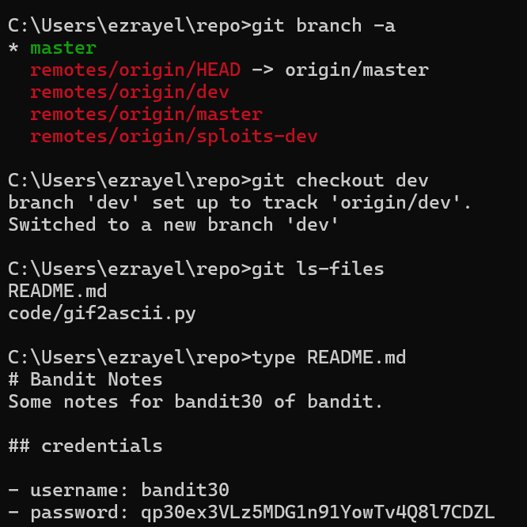

## Level-30
+ Username : bandit30
+  Password :  qp30ex3VLz5MDG1n91YowTv4Q8l7CDZL
+ Domain : git clone ssh://bandit30-git@bandit.labs.overthewire.org:2220/home/bandit30-git/repo
+ Port Num : 2220
### Commands
git = Git version control system
 git clone = Clone a repository into a new directory
 cd = Change directory
 git ls-files = List files
 type = Display the type of a file
 git tag = List tags
 git show = Show object
### Explination
Step-1: Open a terminal on your local machine (Command prompt),Make sure git is installed: git --version, If not, install Git using your OS package manager.

Step-2: Run git command for checking installation or not

Step-3:Clone the repository to use the git clone command.

Step-4: After that it asks for password,  Instead of copy and paste Enter the password Manually.Because it not accepted copy and paste.

Step-5: Then observe path is correct format ok otherwise change it your System path.

Step-6: Then change the path into repo.Already have repo delete that.View list of files in the repo.

Step-7: Read the README file. But it has no password.This level hides the password in a Git tag, not in a file.Then inspect that.

## Level-31
+ Username : bandit31
+  Password :  fb5S2xb7bRyFmAvQYQGEqsbhVyJqhnDy
+ Domain : git clone ssh://bandit31-git@bandit.labs.overthewire.org:2220/home/bandit31-git/repo
+ Port Num : 2220
### Commands
git = Git version control system
 git clone = Clone a repository into a new directory
 cd = Change directory
 git ls-files = List files
 type = Display the type of a file
 echo = Display a string
 git add = Add files to the index
 git commit = Record changes to the repository
 git push = Update remote branches
### Explination
Step-1: Open a terminal on your local machine (Command prompt),Make sure git is installed: git --version, If not, install Git using your OS package manager.

Step-2: Run git command for checking installation or not

Step-3:Clone the repository to use the git clone command.

Step-4: After that it asks for password,  Instead of copy and paste Enter the password Manually.Because it not accepted copy and paste.

Step-5: Then observe path is correct format ok otherwise change it your System path.

Step-6: Then change the path into repo.Already have repo delete that.View list of files in the repo.

Step-7: Read the README file.This time your task is to push a file called key.txt to the repository.

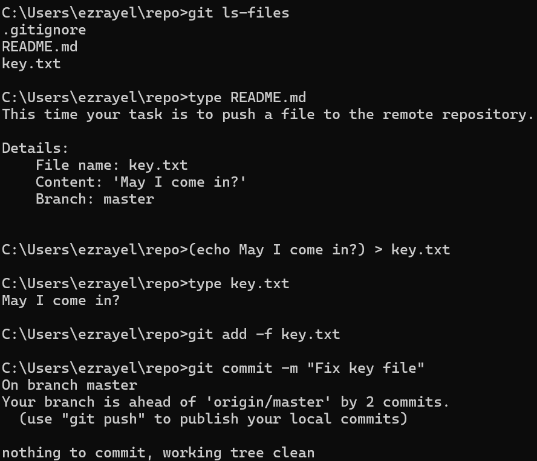

Step-9: After that it asks for password,  Instead of copy and paste Enter the password Manually.Because it not accepted copy and paste.Finally you will get the password.

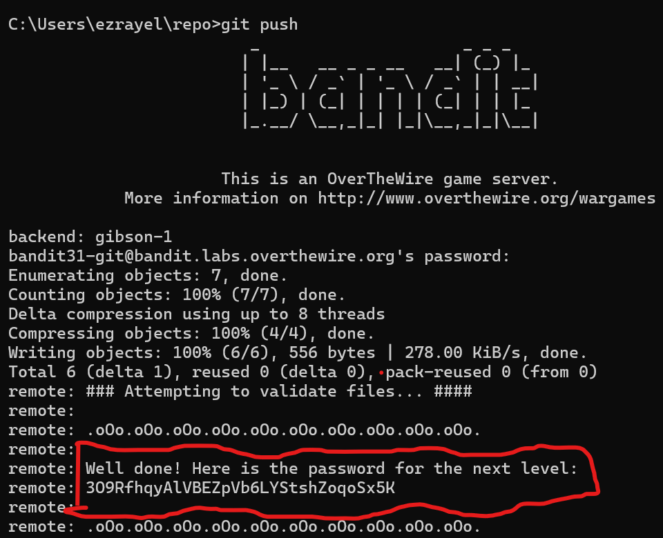

## Level-32
+ Username : bandit32
+  Password :  3O9RfhqyAlVBEZpVb6LYStshZoqoSx5K
+ Domain : ssh bandit32@bandit.labs.overthewire.org -p 2220
+ Port Num : 2220
### Commands
$0 =
whoami = Display the name of the current user
cat = Display the contents of a file
### Explination
Step-1: Login to bandit32

Step-2: Anything you type gets transformed (uppercased) and then executed, which breaks 
normal commands.

Ste-3: Run THis $0 command 

Step-4: It expands to the name of the currently running shell.This launches a new, unrestricted shell.Variable expansion happens before the uppercase transformation

Step-5: For confirmation using Whoami command it will show bandit32

Step-6: Run this commad cat /etc/bandit_pass/bandit33. It will show the password.

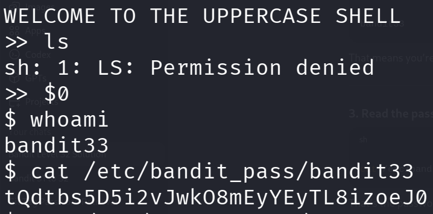

## Level-33
+ Username : bandit33
+  Password :  tQdtbs5D5i2vJwkO8mEyYEyTL8izoeJ0
+ Domain : ssh bandit33@bandit.labs.overthewire.org -p 2220
+ Port Num : 2220
### Explination
At this moment, level 34 does not exist yet.
“Bandit: Level 33 → Level 34 (Level 34 is not available yet).”
“Bandit progression from Level 33 to Level 34 — Level 34 does not currently exist.”
“Bandit Level 33 → 34 (not yet implemented).”