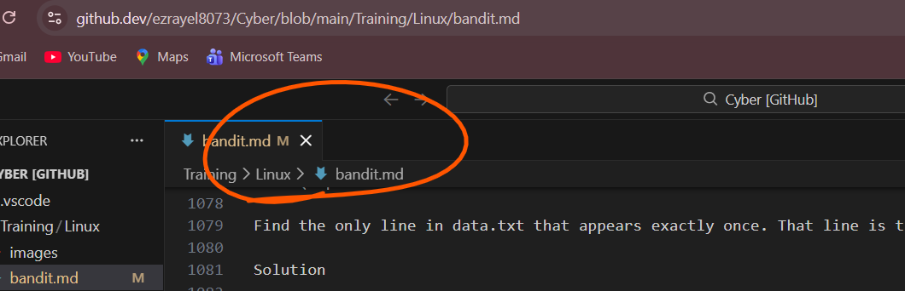

# BANDIT LABS
## Important Points 
    1.ctrl+1 = " commit "
    1.1 Ctrl+shift+i = " inspect "

    2.ctrl+k then leave them thenpress v = you can able to see the updated git 
    that means your not goto the git otherthan you will able see updated git by your own correctons on Vs code 

    3.In a system you have file Like in a Notepad there is a resume file then you can able to see the resume file

    4.It has a properties. In a File properties you can able to see that 3 types  modules

        1.System
        2.You (your mail)
        3.Administrator

    5.These 3 have right on a file Authorization  

    6.Like  The Root is a Administrator in Linux setup

## Terminal
    1.First you can start the terminal you will see the starting stage of terminal the you need to go that terminal you can access that terminal by " sudo su " 

    2.After that terninal can ask you the password 

    3. Password : " kali "

    4. then you enter the password you will not able to see that password but it can automatically access

    5. It will navigate Home that means Root

    6. Looks like  " root@kali "

    7. It will shows in red color. It is the simple checking that  you are in root or not and below that root you will see " #  " in red color 

    8. Finally you can start the Terminal

## Level 0

What you Need to do :

+ Username : bandit0   
+  Password : bandit0                        
+ Domain : bandit0.labs.overthewire.org   
+ Port Num : 2220

### Commands

+ ls = list files  
+ cd = change directory  
+ cat = read file
 
### Explination
 

 
3️⃣ Accept the host key (first time only)

You’ll see something like:

Are you sure you want to continue connecting (yes/no)?

Type:

yes

and press Enter.

If you want, tell me:

what OS you’re on (Linux/macOS/Windows), or

whether you’re using PowerShell, WSL, or a Linux VM

and I’ll tailor the commands exactly for your setup.

Perfect 😄 Linux makes this nice and clean.

You can do everything for Bandit straight from your terminal.

Bandit Level 0 (Linux)

Step-by-step (from your terminal)

1.Open a terminal.

2.Run this command:

Run this command:

ssh bandit0@bandit.labs.overthewire.org -p 2220

-p 2220 is important — SSH defaults to port 22 otherwise.

When prompted for a password, type:

bandit0

(You won’t see the password as you type — that’s normal.)

What success looks like

If it works, you’ll see something like a welcome banner and land in a shell that looks roughly like:

bandit0@bandit:~$

Congrats 🎉 — you’re logged in.

Next step

Once logged in:

Read the on-screen message (or just know this)

Go to the Level 1 page on OverTheWire to see what to do next

Or list files with:

ls

You’ll see a file called readme.

Read it:

cat readme

That file gives you the password for Level 1.

Pro tip (you’ll use this a lot)

To log out later:

exit

      
 

##  Level 1
+ Username : bandit1   
+  Password :                        
+ Domain :    
+ Port Num : 2220
### Commands

+ ls = list files  
+ cd = change directory       
+ cat = read file

### Explination
 

What the level is asking you to do

👉 The password for bandit1 is inside a file called readme
👉 That file is in bandit0’s home directory
👉 Read it, copy the password, then SSH into bandit1

Step-by-step solution
Step 1: Make sure you are logged in as bandit0

If you are not logged in yet, do:

ssh bandit0@bandit.labs.overthewire.org -p 2220

Password:

bandit0

You should see:

bandit0@bandit:~$

Step 2: List files in the home directory

Run:

ls

Output:

readme

✔️ That’s the file we need.

Step 3: Read the readme file

Use cat to display its contents:

cat readme

You’ll see something like:

The password for bandit1 is: XXXXXXXXXXXXX

📌 This string is the password for bandit1

Step 4: SAVE THE PASSWORD (important!)

On your own computer, save it somewhere safe:

Notes app

Text file

Password manager

Example:

Bandit Level 1 password: XXXXXXXXXXXXX

If you lose it, you must start over.

Step 5: Log out from bandit0

Type:

exit

Step 6: Log in as bandit1

Now use the password you just found:

ssh bandit1@bandit.labs.overthewire.org -p 2220

When prompted, paste/type the password from readme.

Step 7: Confirm success

If login works, you’ll see:

bandit1@bandit:~$

🎉 Congrats — Level 1 unlocked!

Step 2: List files

Run:

ls

Output:

     -

That’s the file containing the password.

⚠️ Common mistake (DO NOT do this)

       cat -

❌ This makes cat wait for keyboard input because - means 

       stdin.

Step 3: Correct way to read the file

You have two correct options.

✅ Option 1 (recommended): Use ./

        cat ./-

Step 4: Get the password

You’ll see output like:

XXXXXXXXXXXXXXXXXXXX

📌 This is the password for bandit2

##  Level 2
+ Username : bandit2   
+  Password :                       
+ Domain :    
+ Port Num : 2220
### commands 

  ls = list files

  ls  -i =

  find = Find the files and directories Based on    Name, size, Modification time

### Explination

Step-by-step (from your terminal)

1.Open a terminal.

2.Run this command:

Run this command:

ssh bandit3@bandit.labs.overthewire.org -p 2220

Log in as bandit3

Now use the password you just found:

ssh bandit2@bandit.labs.overthewire.org -p 2220

When prompted, paste/type the password from readme.

Step 7: Confirm success

If login works, you’ll see:

bandit3@bandit:~$

🎉 Congrats — Level 3 unlocked!

1️⃣ List the files

First, see what you’re dealing with:

ls

You should see something like:

spaces in this filename

That entire phrase is one filename, not multiple files.

2️⃣ Read a file with spaces in its name

In Linux, spaces separate arguments, so you must escape them or quote the filename.

Option A: Use quotes (cleanest)
cat "spaces in this filename"

Option B: Escape each space
cat spaces\ in\ this\ filename

Both do the same thing.

## Not  working

## ( option A : cat "spaces in this filename" 
  Option B:  spaces\ in\ this\ filename   

cat "spaces in this filename" Option B: Escape each space cat spaces\ in\ this\ filename use this two commans it will shows the no such file or directory i need correct one )

###### ✅ Step 1: List files exactly

Run this first and copy what you see character-for-character:

   ls -l

You will likely see something like:

-rw-r----- 1 bandit2 bandit2 33 spaces in this filename

Whatever appears between the permissions and the line end is the real filename.

✅ Step 2: Use TAB completion (this avoids mistakes)

Type:

cat sp<TAB>

Your shell should auto-complete to something like:

cat spaces\ in\ this\ filename

Now press Enter.

✔ This is the most reliable method
✔ No guessing
✔ No typos
✔ No “No such file or directory”

✅ Step 3: If TAB doesn’t work, use quotes with exact name

After confirming the name via ls, do:

cat "spaces in this filename"

⚠️ Even one extra space, missing letter, or wrong case = error
Linux filenames are case-sensitive.

#### 🚨 Common causes of your error

Extra space at the end of the filename

Copy-paste included invisible characters

Filename is not exactly what you typed

You’re not in the home directory

To be safe, 

run:

pwd

You should see:

/home/bandit2

If not:

cd ~

✅ Step 2: Show the filename with escaped characters

This reveals hidden weirdness (extra spaces, tabs, etc.):

ls -b

You should see something like:

spaces\ in\ this\ file\ name

This confirms the exact filename.

✅ Step 3: Use the -- trick (VERY important here)

Because the filename starts with spaces, cat can get confused.

👉 THIS is the safest command:

cat -- "spaces in this file name"

or without quotes:

cat -- spaces\ in\ this\ file\ name

-- tells Linux:

“Everything after this is a filename, not an option”

✅ Step 4: Use TAB completion ONLY (no typing)

Do not type the name yourself.

Type:

cat <TAB>

If only one file exists, it will auto-fill completely.
If not, type:

cat sp<TAB>

🚨 If it STILL fails

Run this and paste the output:

ls -lb

That command exposes invisible characters (extra spaces at the start/end).

✅ Summary (this one WILL work)

From /home/bandit2:

cat -- spaces\ in\ this\ file\ name

## It shows no such file or directory
## This is final input to get  output
       🔒 Step 1: Prove the file exists (exactly)

Run this and paste what you see (don’t retype it, just look):

     ls -l

You should see a line similar to:

-rw-r----- 1 bandit2 bandit2 33 spaces in this file name

If you do not see that, stop — the file isn’t there or you’re in the wrong directory.

🔒 Step 2: Let the shell do the work (NO manual typing)

Now type only this:

cat <TAB>

Then press Enter.

If more than one file exists, do:

cat sp<TAB>

👉 This avoids every possible typo, invisible character, or spacing issue.

🔒 Step 3: If that fails, use inode number (guaranteed)

This bypasses the filename entirely.

     ls -i

You’ll see something like:

1234567 spaces in this file name

Now run:

find . -inum 1234567 -exec cat {} \;

(replace 1234567 with the actual number)

✔ This cannot fail if the file exists.

🔒 Step 4: Absolute path (last resort)
cat "/home/bandit2/spaces in this file name"

🚨 If ALL of this fails

Then one of these is true:

You are not logged in as bandit2

You are not in /home/bandit2

The filename contains leading/trailing spaces

To reveal leading/trailing spaces:

ls -lb

🎯 One command that usually wins:
cat $(ls)

Yes — Bandit trick approved.

## Level-3
+ Username : bandit3   
+  Password :                 
+ Domain :   
+ Port Num : 2220
### Commands
ls = list files

 cd = change directory 

ls -a =

  find = Find the files and directories Based on    Name, size, Modification time
### Explination

List files in the home directory:

ls
     
You type ls and the output literally says:

inhere

So the file is inside a directory named inhere, not directly in your home folder.
Here is the 100% correct command sequence you need.

Correct commands (type exactly in this order)

Go into the directory shown by ls:

cd inhere

When your prompt changes to:

~/inhere$

it means:
➡️ You are now inside the inhere directory

Run this command instead:

ls -a

When ls shows:

Hiding from you

Type exactly this while you are in ~/inhere:

find . -type f -exec cat {} \;

👉 Press ENTER

Why this works

find . -type f → finds the file no matter how strange its name is

-exec cat {} \; → prints the contents directly

No quotes, no guessing, no typing the filename

## Level-4
+ Username : bandit4   
+  Password :                        
+ Domain :    
+ Port Num : 2220
### Commands

ls = list files  
+ cd = change directory
ls or ls -a = list files

  find = Find the files and directories Based on    Name, size, Modification time

  cat = read file

### Explination

What’s going on

The password is inside the inhere directory

The file is hidden, meaning its name starts with a .

Normal ls won’t show it unless you ask nicely

ls

Step-by-step solution
1️⃣ Go into the inhere directory
cd inhere

2️⃣ List all files, including hidden ones
ls -a

Step 1️⃣ Check where you are

Run:

pwd

You must see:

/home/bandit4/inhere

If you do not, then run:

cd inhere

Step 2️⃣ Confirm the files really exist

Now run:

ls

You must see something like:

file00  file01  file02  file03  file04  file05  file06  file07  file08  file09

Why ls -1 helps
ls -1

This lists one filename per line, making copy-paste and reading easier.
You should see something like:

-file00
-file01
-file02
-file03
...

⚠️ Important detail:
Notice the filenames actually start with a dash (-).

That’s the trap in this level 😈

Why cat file02 does NOT work

Because the real filename is:

-file02

Linux thinks file02 (without -) does not exist, so cat fails.

✅ Correct way to read the file
Option 1 (best & cleanest)
cat ./-file02

The ./ tells Linux:
👉 “This is a file in the current directory, not an option”

Option 2 (also valid)
cat -- -file02

-- means: stop reading options after this

It shows diamond symboles along with charecteres in a password

Run:

cat ./-file02 | od -An -tx1

This shows the password in hex bytes, proving it’s longer than 4 characters.

You’ll see output like:

61 7f 9a e2 ...

1️⃣ Go to the right place
cd ~/inhere

2️⃣ Identify the ONLY valid password file

Run:

file ./* or file ./-*

You must see exactly ONE line like:

./-file07: ASCII text

⚠️ If it does NOT say ASCII text, it is NOT the password.

3️⃣ Read ONLY that ASCII file

Example:

cat ./-file07

## Level-5
+ Username : bandit5   
+  Password :                         
+ Domain :    
+ Port Num : 2220

### Commands

ls = list files  
+ cd = change directory
ls or ls -1 = list files

  find = Find the files and directories Based on    Name, size, Modification time

  cat = read file

### Explination

ls

Step-by-step solution
1️⃣ Go into the inhere directory
cd inhere

2️⃣ List all files, including hidden ones
ls -a

Step 1️⃣ Check where you are

Run:

pwd

You must see:

/home/bandit4/inhere

If you do not, then run:

cd inhere

Step 2️⃣ Confirm the files really exist

Now run:

ls

You must see something like:

file00  file01  file02  file03  file04  file05  file06  file07  file08  file09

Why ls -1 helps
ls -1

This lists one filename per line, making copy-paste and reading easier.
You should see something like:

-file00
-file01
-file02
-file03
...

Then use this command it will shows the inner file names.
 
file ./*

But this time it shows directories.
Because it has num of files in their directories thats why file ./* command cannot find exact one 

2️⃣ Use find to search smartly

Run this exact command:

find . -type f -size 1033c ! -executable

Why this works

-type f → files only

-size 1033c → exactly 1033 bytes

! -executable → excludes executable files

find → searches recursively under inhere 

3️⃣ You should get ONE result

Example:

./maybehere07/.file2

(Your path may differ slightly, but there will be only one.)

4️⃣ Read the file
cat ./maybehere07/.file2

💥 That output is the password for bandit6.

## Level-6
+ Username : bandit6   
+  Password :                     
+ Domain :   
+ Port Num : 2220
### Commands

find = Find the files and directories Based on    Name, size, Modification time

  cat = Display the file contents on terminal

### Explination

Level 6 has a completely different task:

The password for the next level is stored somewhere on the server and has all of the following properties:

owned by user bandit7

owned by group bandit6

33 bytes in size

Correct solution for Level 6 → 7

Run this from your home directory:

find / -type f -user bandit7 -group bandit6 -size 33c 2>/dev/null

This will return one file, usually:

/var/lib/dpkg/info/bandit7.password

Read it
cat /var/lib/dpkg/info/bandit7.password

That output is your password for Level 7 🎉

Why inhere disappeared

inhere exists only in Level 5

Each level’s filesystem is different

Being “one level off” breaks every instruction

## Level-7
+ Username : bandit7   
+  Password :                     
+ Domain :   
+ Port Num : 2220
### Commands

grep = 

### Explination

🧠 Key Idea

data.txt contains many words/lines. One of them includes the word millionth, and the password is on that same line.

The fastest way to do this is with grep.

✅ Solution Command

Run this in the Bandit Level 7 shell:

grep millionth data.txt

📌 What This Does

grep searches through data.txt

It prints the entire line containing the word millionth

That line looks something like:

🧪 Example Output (yours will differ)
millionth abcdefghijklmnopqrstuvwxyz

👉 The password would be:

abcdefghijklmnopqrstuvwxyz

## Level-8
+ Username : bandit8   
+  Password :                     
+ Domain :   
+ Port Num : 2220
### Commands
ls = list files 

sort = 

uniq =

### Explination

Goal (rephrased)

Find the only line in data.txt that appears exactly once. That line is the password for the next level.

Solution

The classic UNIX pipeline for this task is:

sort data.txt | uniq -u

Why this works

sort data.txt
Groups identical lines together (required for uniq to work correctly).

uniq -u
Prints only lines that occur once.

The output of this command is the password for Bandit Level 9.

Optional: Step-by-step inspection

If you want to see what’s happening at each stage:

sort data.txt

Then:

sort data.txt | uniq

And finally:

sort data.txt | uniq -u

Key concept learned

🔹 Pipes (|) let you pass the output of one command directly into another.
🔹 sort + uniq is a very common pattern for frequency-based text analysis in Linux.

## Level-9
+ Username : bandit9   
+  Password :                     
+ Domain :   
+ Port Num : 2220
### Commands
ls = list files 

strings = 

grep =

### Explination

The hint tells you exactly what to look for: a human-readable string in data.txt that is preceded by several = characters.

Inspect data.txt
data.txt is mostly binary, so opening it with cat won’t help.

Use strings to extract human-readable text:

strings data.txt

This will output all readable character sequences from the file.

Filter for lines with = characters
The password is preceded by several = characters, so pipe the output to grep:

strings data.txt | grep "==="

(You can also use "==" if you want broader matching.)

Find the password
Among the results, you’ll see something like:

========== thePasswordIsHere

The password is the readable text after the = signs.

One-liner solution (clean and common)
strings data.txt | grep "==="

Why this works

strings → extracts readable ASCII text from a binary file

grep "===" → narrows results to lines matching the level hint

The password is intentionally easy to spot once filtered correctly

## Level-10
+ Username : bandit10   
+  Password :                     
+ Domain :   
+ Port Num : 2220
### Commands
ls = list files 

cat = Display the file contents on terminal

 base64 =  

### Explination

List files

ls

You should see:

data.txt

Decode the Base64 data

base64 -d data.txt

or equivalently:

cat data.txt | base64 --decode

Output
The command prints the password for Level 11 directly to the terminal.

Why this works

base64 is a reversible encoding (not encryption)

-d / --decode tells the command to convert it back to plain text

## Level-11
+ Username : bandit11   
+  Password :                     
+ Domain :   
+ Port Num : 2220
### Commands

cat = Display the file contents on terminal

tr = 

### Explination

What’s going on

The password is in data.txt.

All letters (a–z, A–Z) are rotated by 13 positions (ROT13).

Numbers and symbols are unchanged.

ROT13 is symmetric: applying it once decodes the text.

How to solve it

Use tr to rotate the characters back:

cat data.txt | tr 'A-Za-z' 'N-ZA-Mn-za-m'

This command:

Reads the file

Translates:

A–Z → N–Z A–M

a–z → n–z a–m

Prints the decoded password to the terminal

Why this works

ROT13 shifts each letter 13 places:

a ↔ n, b ↔ o, …, m ↔ z

Same logic for uppercase letters

Because the alphabet has 26 letters, rotating by 13 twice returns the original text.

## Level-12
+ Username : bandit12TguMNxKo1DSa1tujBLuZJnDUlCcUAPlI   
+  Password :                     
+ Domain :   
+ Port Num : 2220
### Commands

sort = 

uniq =

### Explination

\images\

